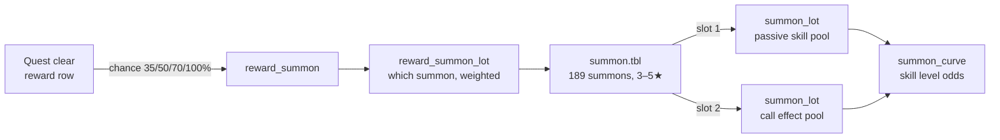

# Summon drop tables — every stage, every summon, every stat

**Generated from the vanilla 2.0 tables** by `scripts/gen-summon-drop-tables.mjs`
(chain decode: [docs/23](../../docs/23-summon-skill-drops.md)). Drop % and skill
levels shown are VANILLA; with [Summon Drops Maxed](README.md) every listed source
drops at **100%** and every skill rolls at the **top of its level range**.

## 1. Stages → summons

177 reward sources can drop a summon. Sources whose reward-row id
resolves to a quest are named (suffix _100 = the per-clear reward row; _400/_403 =
2.0-added rows, semantics unconfirmed); the rest are listed by reward-key hash.

| Source | Drop % | Summons (weight) |
|---|---|---|
| **Jumbo Crab's Title Fight** (408302, reward 400) | 100% | Wee Pincer 3★ 25%, Rock Golem 4★ 13%, Fire Spirit 3★ 24%, Water Spirit 3★ 22%, Wee Pincer 4★ 10%, Family Zathba 3★ 6% |
| **Jumbo Crab's Title Fight** (408302, reward 403) | 50% | Wee Pincer 3★ 32%, Rock Golem 4★ 28%, Fire Spirit 3★ 10%, Water Spirit 3★ 8%, Wee Pincer 4★ 16%, Family Zathba 3★ 6% |
| **Sun Blotter** (408305, reward 400) | 100% | Wyvern 3★ 35%, Griffin 4★ 12%, Hornbird 3★ 28%, Obsidian Raptor 4★ 8%, Elder Wyvern 3★ 11%, Hope-Filled Skydwellers 3★ 6% |
| **Sun Blotter** (408305, reward 403) | 50% | Wyvern 3★ 18%, Griffin 4★ 30%, Hornbird 3★ 15%, Obsidian Raptor 4★ 15%, Elder Wyvern 3★ 16%, Hope-Filled Skydwellers 3★ 6% |
| **Gray Gear Reverberance** (408306, reward 400) | 100% | Droita Mother 3★ 30%, Mechanized Executioner 4★ 18%, Droita Mother (Assault) 3★ 12%, Flame Gyre 3★ 19%, Aqua Gyre 3★ 15%, Seedhollow Guardians 3★ 6% |
| **Gray Gear Reverberance** (408306, reward 403) | 50% | Droita Mother 3★ 18%, Mechanized Executioner 4★ 37%, Droita Mother (Assault) 3★ 27%, Flame Gyre 3★ 8%, Aqua Gyre 3★ 6%, Seedhollow Guardians 3★ 4% |
| **The General Assembly** (408310, reward 400) | 100% | Silverslime 4★ 34%, Goldslime 4★ 28%, Wheel of Fate 3★ 25%, Ancient Dragon 4★ 13% |
| **The General Assembly** (408310, reward 403) | 50% | Silverslime 4★ 26%, Goldslime 4★ 24%, Wheel of Fate 3★ 25%, Ancient Dragon 4★ 25% |
| **You're Being Watched** (408311, per-clear) | 100% | Cyaegha 3★ 100% |
| **You're Being Watched** (408311, reward 400) | 100% | Cyaegha 3★ 30%, Nazarbonju 4★ 15%, Ahriman 3★ 25%, Scarmiglione 4★ 10%, Silent Watcher 3★ 15%, Mellose Clan 3★ 5% |
| **You're Being Watched** (408311, reward 403) | 50% | Cyaegha 3★ 10%, Nazarbonju 4★ 40%, Ahriman 3★ 9%, Scarmiglione 4★ 25%, Silent Watcher 3★ 6%, Mellose Clan 3★ 10% |
| **In the Depths of Madness** (408312, reward 400) | 100% | Goblin Soldier 3★ 35%, Goblin Warrior 4★ 15%, Cruel Overseer 3★ 8%, Goblin Gladiator 3★ 25%, Storm-Mane Gatekeeper 4★ 7%, Scarlet-Shell Butcher 3★ 5%, Folcan Defense Corps 3★ 5% |
| **In the Depths of Madness** (408312, reward 403) | 50% | Goblin Soldier 3★ 12%, Goblin Warrior 4★ 25%, Cruel Overseer 3★ 23%, Goblin Gladiator 3★ 8%, Storm-Mane Gatekeeper 4★ 14%, Scarlet-Shell Butcher 3★ 12%, Folcan Defense Corps 3★ 6% |
| **Spear of the Invincible** (408313, per-clear) | 100% | Silver Wolf Corps 3★ 100% |
| **Spear of the Invincible** (408313, reward 400) | 100% | Dark Gyre 3★ 25%, Gerasene 4★ 19%, Cobra 3★ 23%, Timber Wolf 3★ 18%, True Believers 3★ 9%, Silver Wolf Corps 3★ 6% |
| **Spear of the Invincible** (408313, reward 403) | 50% | Dark Gyre 3★ 18%, Gerasene 4★ 50%, Cobra 3★ 12%, Timber Wolf 3★ 9%, True Believers 3★ 6%, Silver Wolf Corps 3★ 5% |
| **One-Woman Army** (408315, per-clear) | 100% | Ballistic Ballista 4★ 100% |
| **One-Woman Army** (408315, reward 400) | 100% | Sand Reaper 3★ 17%, Ballistic Ballista 4★ 14%, Ominous Form 3★ 29%, Light Gyre 3★ 25%, Crew Alliance Rafale 3★ 9%, Sword Veil Fellowship 3★ 6% |
| **One-Woman Army** (408315, reward 403) | 50% | Sand Reaper 3★ 30%, Ballistic Ballista 4★ 25%, Ominous Form 3★ 15%, Light Gyre 3★ 13%, Crew Alliance Rafale 3★ 11%, Sword Veil Fellowship 3★ 6% |
| **Bestial Earth** (409302, per-clear) | 100% | Quakadile 4★ 100% |
| **Bestial Earth** (409302, reward 400) | 100% | Quakadile 4★ 17%, Timber Wolf 4★ 30%, Storm-Mane Gatekeeper 4★ 12%, Goblin Soldier 4★ 25%, Folcan Defense Corps 4★ 10%, Quakadile 5★ 6% |
| **Bestial Earth** (409302, reward 403) | 70% | Quakadile 4★ 30%, Timber Wolf 4★ 14%, Storm-Mane Gatekeeper 4★ 25%, Goblin Soldier 4★ 10%, Folcan Defense Corps 4★ 8%, Quakadile 5★ 13% |
| **Abandon Hope** (409303, per-clear) | 100% | Gerasene 4★ 100% |
| **Abandon Hope** (409303, reward 400) | 100% | Gerasene 4★ 25%, Droita Mother 4★ 23%, Ominous Form 4★ 20%, Seedhollow Guardians 4★ 17%, Gerasene 5★ 15% |
| **Abandon Hope** (409303, reward 403) | 70% | Gerasene 4★ 25%, Droita Mother 4★ 23%, Ominous Form 4★ 20%, Seedhollow Guardians 4★ 17%, Gerasene 5★ 15% |
| **Bestial Frost** (409305, per-clear) | 100% | Blizzadile 4★ 100% |
| **Bestial Frost** (409305, reward 400) | 100% | Blizzadile 4★ 17%, Silent Watcher 4★ 35%, Water Spirit 4★ 30%, True Believers 4★ 11%, Blizzadile 5★ 7% |
| **Bestial Frost** (409305, reward 403) | 70% | Blizzadile 4★ 35%, Silent Watcher 4★ 20%, Water Spirit 4★ 16%, True Believers 4★ 9%, Blizzadile 5★ 20% |
| **Permafrost** (409307, per-clear) | 100% | Wilinus Icewyrm 4★ 100% |
| **Permafrost** (409307, reward 400) | 100% | Wilinus Icewyrm 4★ 23%, Corvell Earthwyrm 4★ 21%, Dark Gyre 4★ 18%, Crew Alliance Rafale 4★ 16%, Wilinus Icewyrm 5★ 12%, Corvell Earthwyrm 5★ 10% |
| **Permafrost** (409307, reward 403) | 70% | Wilinus Icewyrm 4★ 23%, Corvell Earthwyrm 4★ 21%, Dark Gyre 4★ 18%, Crew Alliance Rafale 4★ 16%, Wilinus Icewyrm 5★ 12%, Corvell Earthwyrm 5★ 10% |
| **Sephira's Sanguine Glimmer** (409309, reward 400) | 100% | Rock Golem 4★ 25%, Goblin Gladiator 4★ 23%, Cobra 4★ 20%, Sand Reaper 4★ 17%, Rock Golem 5★ 15% |
| **Sephira's Sanguine Glimmer** (409309, reward 403) | 70% | Rock Golem 4★ 25%, Goblin Gladiator 4★ 23%, Cobra 4★ 20%, Sand Reaper 4★ 17%, Rock Golem 5★ 15% |
| **Revenge of the Ooze** (409311, per-clear) | 100% | Corvell Earthwyrm 4★ 100% |
| **Wildfire** (409312, per-clear) | 100% | Vrazarek Firewyrm 4★ 100% |
| **Wildfire** (409312, reward 400) | 100% | Vrazarek Firewyrm 4★ 23%, Elusious Windwyrm 4★ 21%, Light Gyre 4★ 18%, Family Zathba 4★ 16%, Vrazarek Firewyrm 5★ 12%, Elusious Windwyrm 5★ 10% |
| **Wildfire** (409312, reward 403) | 70% | Vrazarek Firewyrm 4★ 23%, Elusious Windwyrm 4★ 21%, Light Gyre 4★ 18%, Family Zathba 4★ 16%, Vrazarek Firewyrm 5★ 12%, Elusious Windwyrm 5★ 10% |
| **Bestial Blaze** (409313, per-clear) | 100% | Infernadile 4★ 100% |
| **Bestial Blaze** (409313, reward 400) | 100% | Infernadile 4★ 20%, Elder Wyvern 4★ 18%, Fire Spirit 4★ 37%, Silver Wolf Corps 4★ 13%, Infernadile 5★ 12% |
| **Bestial Blaze** (409313, reward 403) | 70% | Infernadile 4★ 35%, Elder Wyvern 4★ 21%, Fire Spirit 4★ 18%, Silver Wolf Corps 4★ 10%, Infernadile 5★ 16% |
| **Shadows of the Past: Sequestration** (409314, reward 400) | 100% | Managarmr 4★ 15%, Aqua Gyre 4★ 32%, Scarmiglione 4★ 12%, Cyaegha 4★ 27%, Mellose Clan 4★ 7%, Managarmr 5★ 7% |
| **Shadows of the Past: Sequestration** (409314, reward 403) | 70% | Managarmr 4★ 27%, Aqua Gyre 4★ 18%, Scarmiglione 4★ 23%, Cyaegha 4★ 12%, Mellose Clan 4★ 7%, Managarmr 5★ 13% |
| **Procession of Dragons** (409315, reward 400) | 100% | Wheel of Fate 4★ 24%, Vrazarek Firewyrm 5★ 19%, Elusious Windwyrm 5★ 19%, Wilinus Icewyrm 5★ 19%, Corvell Earthwyrm 5★ 19% |
| **Procession of Dragons** (409315, reward 403) | 70% | Wheel of Fate 4★ 24%, Vrazarek Firewyrm 5★ 19%, Elusious Windwyrm 5★ 19%, Wilinus Icewyrm 5★ 19%, Corvell Earthwyrm 5★ 19% |
| **Shadows of the Past: Vitality** (409317, reward 400) | 100% | Furycane 4★ 15%, Hornbird 4★ 32%, Obsidian Raptor 4★ 11%, Wyvern 4★ 25%, Hope-Filled Skydwellers 4★ 10%, Furycane 5★ 7% |
| **Shadows of the Past: Vitality** (409317, reward 403) | 70% | Furycane 4★ 27%, Hornbird 4★ 16%, Obsidian Raptor 4★ 22%, Wyvern 4★ 12%, Hope-Filled Skydwellers 4★ 12%, Furycane 5★ 11% |
| **Shadows of the Past: Dread** (409319, reward 400) | 100% | Vulkan Bolla 4★ 18%, Flame Gyre 4★ 36%, Ahriman 4★ 27%, Sword Veil Fellowship 4★ 12%, Vulkan Bolla 5★ 7% |
| **Shadows of the Past: Dread** (409319, reward 403) | 70% | Vulkan Bolla 4★ 35%, Flame Gyre 4★ 23%, Ahriman 4★ 20%, Sword Veil Fellowship 4★ 10%, Vulkan Bolla 5★ 12% |
| **Bring Light to the World** (409320, per-clear) | 100% | Cobra 4★ 100% |
| **New World Order** (40A301, reward 400) | 100% | Mechanized Executioner 5★ 23%, Droita Mother 4★ 21%, Dark Gyre 4★ 18%, Scarmiglione 5★ 16%, True Believers 5★ 12%, Rolan 5★ 10% |
| **New World Order** (40A301, reward 403) | 100% | Mechanized Executioner 5★ 23%, Droita Mother 4★ 21%, Dark Gyre 4★ 18%, Scarmiglione 5★ 16%, True Believers 5★ 12%, Rolan 5★ 10% |
| **Weight of a Blade** (40A303, per-clear) | 100% | Goblin Gladiator 4★ 100% |
| **Weight of a Blade** (40A303, reward 400) | 100% | Ballistic Ballista 5★ 23%, Droita Mother (Assault) 4★ 21%, Hornbird 4★ 18%, Scarmiglione 5★ 16%, Mellose Clan 5★ 12%, Blizzadile 5★ 10% |
| **Weight of a Blade** (40A303, reward 403) | 100% | Ballistic Ballista 5★ 23%, Droita Mother (Assault) 4★ 21%, Hornbird 4★ 18%, Scarmiglione 5★ 16%, Mellose Clan 5★ 12%, Blizzadile 5★ 10% |
| **Lightning Strikes Twice** (40A305, reward 400) | 100% | Radis Whitewyrm 4★ 23%, Scarlet-Shell Butcher 4★ 21%, Timber Wolf 4★ 18%, Silverslime 5★ 16%, Radis Whitewyrm 5★ 12%, Folcan Defense Corps 5★ 10% |
| **Lightning Strikes Twice** (40A305, reward 403) | 100% | Radis Whitewyrm 4★ 23%, Scarlet-Shell Butcher 4★ 21%, Timber Wolf 4★ 18%, Silverslime 5★ 16%, Radis Whitewyrm 5★ 12%, Folcan Defense Corps 5★ 10% |
| **All-Consuming Darkness** (40A306, per-clear) | 100% | Evyl Blackwyrm 5★ 100% |
| **All-Consuming Darkness** (40A306, reward 400) | 100% | Evyl Blackwyrm 4★ 23%, Cruel Overseer 4★ 21%, Elder Wyvern 4★ 18%, Obsidian Raptor 5★ 16%, Evyl Blackwyrm 5★ 12%, Seedhollow Guardians 5★ 10% |
| **All-Consuming Darkness** (40A306, reward 403) | 100% | Evyl Blackwyrm 4★ 23%, Cruel Overseer 4★ 21%, Elder Wyvern 4★ 18%, Obsidian Raptor 5★ 16%, Evyl Blackwyrm 5★ 12%, Seedhollow Guardians 5★ 10% |
| **Flavor Blast!** (40A307, per-clear) | 100% | Wheel of Fate 4★ 100% |
| **The Eternal Grind** (40A308, reward 400) | 100% | Gerasene 5★ 23%, Droita Mother (Assault) 4★ 21%, Fire Spirit 4★ 18%, Furycane Nihilla 5★ 16%, Sword Veil Fellowship 5★ 12%, Furycane 5★ 10% |
| **The Eternal Grind** (40A308, reward 403) | 100% | Gerasene 5★ 23%, Droita Mother (Assault) 4★ 21%, Fire Spirit 4★ 18%, Furycane Nihilla 5★ 16%, Sword Veil Fellowship 5★ 12%, Furycane 5★ 10% |
| **A Reckoning for the Reckoner** (40A309, reward 400) | 100% | Vulkan Bolla 5★ 28%, Sand Reaper 4★ 26%, Goblin Warrior 5★ 24%, Vulkan Bolla Nihilla 5★ 22% |
| **A Reckoning for the Reckoner** (40A309, reward 403) | 100% | Vulkan Bolla 5★ 28%, Sand Reaper 4★ 26%, Goblin Warrior 5★ 24%, Vulkan Bolla Nihilla 5★ 22% |
| **Tectonic Clash** (40A310, per-clear) | 100% | Ruby Golem 5★ 100% |
| **Tectonic Clash** (40A310, reward 400) | 100% | Rock Golem 5★ 23%, Aqua Gyre 4★ 21%, Wyvern 4★ 18%, Ruby Golem 5★ 16%, Hope-Filled Skydwellers 5★ 12%, Quakadile 5★ 10% |
| **Tectonic Clash** (40A310, reward 403) | 100% | Rock Golem 5★ 23%, Aqua Gyre 4★ 21%, Wyvern 4★ 18%, Ruby Golem 5★ 16%, Hope-Filled Skydwellers 5★ 12%, Quakadile 5★ 10% |
| **Terror from the Moon** (40A311, per-clear) | 100% | Pyet-A 4★ 100% |
| **Terror from the Moon** (40A311, reward 400) | 100% | Pyet-A 4★ 23%, Ominous Form 4★ 21%, Light Gyre 4★ 18%, Nazarbonju 5★ 16%, Pyet-A 5★ 12%, Family Zathba 5★ 10% |
| **Terror from the Moon** (40A311, reward 403) | 100% | Pyet-A 4★ 23%, Ominous Form 4★ 21%, Light Gyre 4★ 18%, Nazarbonju 5★ 16%, Pyet-A 5★ 12%, Family Zathba 5★ 10% |
| **Mazurka of War** (40A312, reward 400) | 100% | Goldslime 5★ 24%, Griffin 5★ 22%, Ballistic Ballista 5★ 20%, Ancient Dragon 5★ 18%, Blood-Dyed Rakshasa 5★ 16% |
| **Mazurka of War** (40A312, reward 403) | 100% | Goldslime 5★ 24%, Griffin 5★ 22%, Ballistic Ballista 5★ 20%, Ancient Dragon 5★ 18%, Blood-Dyed Rakshasa 5★ 16% |
| **A Prayer for Black Wings' Demise** (40A313, reward 400) | 100% | Managarmr 5★ 28%, Water Spirit 4★ 26%, Lucilius 5★ 24%, Managarmr Nihilla 5★ 22% |
| **A Prayer for Black Wings' Demise** (40A313, reward 403) | 100% | Managarmr 5★ 28%, Water Spirit 4★ 26%, Lucilius 5★ 24%, Managarmr Nihilla 5★ 22% |
| **Let Chaos Reign** (40A314, per-clear) | 100% | Silverslime 5★ 100% |
| **Let Chaos Reign** (40A314, reward 400) | 100% | Storm-Mane Gatekeeper 5★ 28%, Cobra 4★ 26%, Beelzebub 5★ 24%, Silverslime 5★ 22% |
| **Let Chaos Reign** (40A314, reward 403) | 100% | Storm-Mane Gatekeeper 5★ 28%, Cobra 4★ 26%, Beelzebub 5★ 24%, Silverslime 5★ 22% |
| **The Not Forgotten Sky** (40A316, reward 400) | 100% | Vrazarek Firewyrm 5★ 16.7%, Wilinus Icewyrm 5★ 16.7%, Corvell Earthwyrm 5★ 16.7%, Elusious Windwyrm 5★ 16.7%, Radis Whitewyrm 5★ 16.7%, Evyl Blackwyrm 5★ 16.7% |
| **The Not Forgotten Sky** (40A316, reward 403) | 100% | Vrazarek Firewyrm 5★ 16.7%, Wilinus Icewyrm 5★ 16.7%, Corvell Earthwyrm 5★ 16.7%, Elusious Windwyrm 5★ 16.7%, Radis Whitewyrm 5★ 16.7%, Evyl Blackwyrm 5★ 16.7% |
| **Roar from the Heavens** (40A320, per-clear) | 100% | Ancient Dragon 4★ 100% |
| **Roar from the Heavens** (40A320, reward 400) | 100% | Ancient Dragon 5★ 23%, Cyaegha 4★ 21%, Ahriman 4★ 18%, Infernadile 5★ 16%, Crew Alliance Rafale 5★ 12%, Goblin Warrior 5★ 10% |
| **Roar from the Heavens** (40A320, reward 403) | 100% | Ancient Dragon 5★ 23%, Cyaegha 4★ 21%, Ahriman 4★ 18%, Infernadile 5★ 16%, Crew Alliance Rafale 5★ 12%, Goblin Warrior 5★ 10% |
| **Supernatural Appetite for Meat** (40A321, per-clear) | 100% | Behemoth 5★ 100% |
| **Supernatural Appetite for Meat** (40A321, reward 400) | 100% | Ennugi 4★ 23%, Flame Gyre 4★ 21%, Silent Watcher 4★ 18%, Behemoth 5★ 16%, Ennugi 5★ 12%, Silver Wolf Corps 5★ 10% |
| **Supernatural Appetite for Meat** (40A321, reward 403) | 100% | Ennugi 4★ 23%, Flame Gyre 4★ 21%, Silent Watcher 4★ 18%, Behemoth 5★ 16%, Ennugi 5★ 12%, Silver Wolf Corps 5★ 10% |
| **The Myths Are Real** (40A322, reward 400) | 100% | Gerasene 5★ 30%, Scarmiglione 5★ 27%, Behemoth 5★ 23%, Ennugi 5★ 20% |
| **The Myths Are Real** (40A322, reward 403) | 100% | Gerasene 5★ 30%, Scarmiglione 5★ 27%, Behemoth 5★ 23%, Ennugi 5★ 20% |
| **In the Wrong Hands** (40A323, reward 400) | 100% | Blood-Dyed Rakshasa 5★ 37%, Griffin 5★ 34%, Obsidian Raptor 5★ 29% |
| **In the Wrong Hands** (40A323, reward 403) | 100% | Blood-Dyed Rakshasa 5★ 37%, Griffin 5★ 34%, Obsidian Raptor 5★ 29% |
| **The Tempest Rises** (40A324, reward 400) | 100% | Furycane 5★ 70%, Furycane Nihilla 5★ 30% |
| **The Tempest Rises** (40A324, reward 403) | 100% | Furycane 5★ 70%, Furycane Nihilla 5★ 30% |
| **Reclusive Vengeance** (40A325, reward 400) | 100% | Managarmr 5★ 70%, Managarmr Nihilla 5★ 30% |
| **Reclusive Vengeance** (40A325, reward 403) | 100% | Managarmr 5★ 70%, Managarmr Nihilla 5★ 30% |
| **Four Dragons of the Apocalypse** (40A326, reward 400) | 100% | Vrazarek Firewyrm 5★ 25%, Elusious Windwyrm 5★ 25%, Wilinus Icewyrm 5★ 25%, Corvell Earthwyrm 5★ 25% |
| **Four Dragons of the Apocalypse** (40A326, reward 403) | 100% | Vrazarek Firewyrm 5★ 25%, Elusious Windwyrm 5★ 25%, Wilinus Icewyrm 5★ 25%, Corvell Earthwyrm 5★ 25% |
| **Rock Around the Clock** (40A327, reward 400) | 100% | Rock Golem 5★ 40%, Storm-Mane Gatekeeper 5★ 35%, Ruby Golem 5★ 25% |
| **Rock Around the Clock** (40A327, reward 403) | 100% | Rock Golem 5★ 40%, Storm-Mane Gatekeeper 5★ 35%, Ruby Golem 5★ 25% |
| **An Act of Automagod** (40A328, reward 400) | 100% | Pyet-A 5★ 70%, Mechanized Executioner 5★ 30% |
| **An Act of Automagod** (40A328, reward 403) | 100% | Pyet-A 5★ 70%, Mechanized Executioner 5★ 30% |
| **Beneath Primeval Wings** (40A329, reward 400) | 100% | Vulkan Bolla 5★ 70%, Vulkan Bolla Nihilla 5★ 30% |
| **Beneath Primeval Wings** (40A329, reward 403) | 100% | Vulkan Bolla 5★ 70%, Vulkan Bolla Nihilla 5★ 30% |
| **Eternal Pride** (40A330, reward 400) | 100% | Quakadile 5★ 33.3%, Blizzadile 5★ 33.3%, Infernadile 5★ 33.3% |
| **Eternal Pride** (40A330, reward 403) | 100% | Quakadile 5★ 33.3%, Blizzadile 5★ 33.3%, Infernadile 5★ 33.3% |
| **On the Threshold of The World** (40B301, per-clear) | 100% | Rolan 5★ 100% |
| **On the Threshold of The World** (40B301, reward 400) | 100% | Rolan 5★ 60%, Cat 5★ 30%, Wheel of Fate 5★ 10% |
| **On the Threshold of The World** (40B301, reward 403) | 100% | Rolan 5★ 60%, Cat 5★ 30%, Wheel of Fate 5★ 10% |
| **On the Threshold of Destruction** (40B309, per-clear) | 100% | Lilith 5★ 100% |
| **On the Threshold of Destruction** (40B309, reward 400) | 100% | Ancient Dragon 5★ 60%, Pyet-A 5★ 30%, Lilith 5★ 10% |
| **On the Threshold of Destruction** (40B309, reward 403) | 100% | Ancient Dragon 5★ 60%, Pyet-A 5★ 30%, Lilith 5★ 10% |
| **On the Threshold of Finality** (40B313, per-clear) | 100% | Lucilius 5★ 100% |
| **On the Threshold of Finality** (40B313, reward 400) | 100% | Referee 5★ 70%, Lucilius 5★ 30% |
| **On the Threshold of Finality** (40B313, reward 403) | 100% | Referee 5★ 70%, Lucilius 5★ 30% |
| **On the Threshold of Chaos** (40B314, per-clear) | 100% | Beelzebub 5★ 100% |
| **On the Threshold of Chaos** (40B314, reward 400) | 100% | Beelzebub 5★ 70%, Goldslime 5★ 30% |
| **On the Threshold of Chaos** (40B314, reward 403) | 100% | Beelzebub 5★ 70%, Goldslime 5★ 30% |
| **On the Threshold of Provenance** (40B316, reward 400) | 100% | Radis Whitewyrm 5★ 40%, Evyl Blackwyrm 5★ 40%, Wee Pincer 5★ 20% |
| **On the Threshold of Provenance** (40B316, reward 403) | 100% | Radis Whitewyrm 5★ 40%, Evyl Blackwyrm 5★ 40%, Wee Pincer 5★ 20% |
| unidentified source `A0B0DCFD` | 100% | Albacore 4★ 100% |
| unidentified source `27BD324C` | 100% | Albacore 5★ 100% |
| unidentified source `AF16E728` | 100% | Lurker in the Dark 4★ 100% |
| unidentified source `8D3C37B8` | 100% | True Believers 3★ 100% |
| unidentified source `2D73E6B3` | 100% | Mellose Clan 5★ 100% |
| unidentified source `699A007F` | 100% | Folcan Defense Corps 5★ 100% |
| unidentified source `EA457997` | 100% | Family Zathba 3★ 100% |
| unidentified source `A7411FB0` | 100% | Wheel of Fate 4★ 100% |
| unidentified source `E751AFF0` | 35% | Hope-Filled Skydwellers 3★ 12%, True Believers 3★ 12%, Folcan Defense Corps 3★ 12%, Silver Wolf Corps 3★ 12%, Sword Veil Fellowship 3★ 12%, Mellose Clan 3★ 12%, Crew Alliance Rafale 3★ 12%, Wee Pincer 3★ 8%, Wheel of Fate 3★ 8% |
| unidentified source `F37EC4AB` | 35% | Hope-Filled Skydwellers 3★ 12%, True Believers 3★ 12%, Folcan Defense Corps 3★ 12%, Silver Wolf Corps 3★ 12%, Sword Veil Fellowship 3★ 12%, Mellose Clan 3★ 12%, Crew Alliance Rafale 3★ 12%, Wee Pincer 3★ 8%, Wheel of Fate 3★ 8% |
| unidentified source `09CF3D0D` | 35% | Hope-Filled Skydwellers 3★ 12%, True Believers 3★ 12%, Folcan Defense Corps 3★ 12%, Silver Wolf Corps 3★ 12%, Sword Veil Fellowship 3★ 12%, Mellose Clan 3★ 12%, Crew Alliance Rafale 3★ 12%, Wee Pincer 3★ 8%, Wheel of Fate 3★ 8% |
| unidentified source `D9385A11` | 35% | Hope-Filled Skydwellers 3★ 12%, True Believers 3★ 12%, Folcan Defense Corps 3★ 12%, Silver Wolf Corps 3★ 12%, Sword Veil Fellowship 3★ 12%, Mellose Clan 3★ 12%, Crew Alliance Rafale 3★ 12%, Wee Pincer 3★ 8%, Wheel of Fate 3★ 8% |
| unidentified source `D4C75A25` | 35% | Hope-Filled Skydwellers 3★ 9%, Hope-Filled Skydwellers 4★ 3%, True Believers 3★ 9%, True Believers 4★ 3%, Folcan Defense Corps 3★ 9%, Folcan Defense Corps 4★ 3%, Silver Wolf Corps 3★ 9%, Silver Wolf Corps 4★ 3%, Sword Veil Fellowship 3★ 9%, Sword Veil Fellowship 4★ 3%, Mellose Clan 3★ 9%, Mellose Clan 4★ 3%, Crew Alliance Rafale 3★ 9%, Crew Alliance Rafale 4★ 3%, Wee Pincer 3★ 6%, Wee Pincer 4★ 2%, Wheel of Fate 3★ 6%, Wheel of Fate 4★ 2% |
| unidentified source `CE7A85D7` | 35% | Hope-Filled Skydwellers 3★ 9%, Hope-Filled Skydwellers 4★ 3%, True Believers 3★ 9%, True Believers 4★ 3%, Folcan Defense Corps 3★ 9%, Folcan Defense Corps 4★ 3%, Silver Wolf Corps 3★ 9%, Silver Wolf Corps 4★ 3%, Sword Veil Fellowship 3★ 9%, Sword Veil Fellowship 4★ 3%, Mellose Clan 3★ 9%, Mellose Clan 4★ 3%, Crew Alliance Rafale 3★ 9%, Crew Alliance Rafale 4★ 3%, Wee Pincer 3★ 6%, Wee Pincer 4★ 2%, Wheel of Fate 3★ 6%, Wheel of Fate 4★ 2% |
| unidentified source `F5A9E504` | 35% | Hope-Filled Skydwellers 3★ 9%, Hope-Filled Skydwellers 4★ 3%, True Believers 3★ 9%, True Believers 4★ 3%, Folcan Defense Corps 3★ 9%, Folcan Defense Corps 4★ 3%, Silver Wolf Corps 3★ 9%, Silver Wolf Corps 4★ 3%, Sword Veil Fellowship 3★ 9%, Sword Veil Fellowship 4★ 3%, Mellose Clan 3★ 9%, Mellose Clan 4★ 3%, Crew Alliance Rafale 3★ 9%, Crew Alliance Rafale 4★ 3%, Wee Pincer 3★ 6%, Wee Pincer 4★ 2%, Wheel of Fate 3★ 6%, Wheel of Fate 4★ 2% |
| unidentified source `1A1EB4E1` | 35% | Hope-Filled Skydwellers 3★ 9%, Hope-Filled Skydwellers 4★ 3%, True Believers 3★ 9%, True Believers 4★ 3%, Folcan Defense Corps 3★ 9%, Folcan Defense Corps 4★ 3%, Silver Wolf Corps 3★ 9%, Silver Wolf Corps 4★ 3%, Sword Veil Fellowship 3★ 9%, Sword Veil Fellowship 4★ 3%, Mellose Clan 3★ 9%, Mellose Clan 4★ 3%, Crew Alliance Rafale 3★ 9%, Crew Alliance Rafale 4★ 3%, Wee Pincer 3★ 6%, Wee Pincer 4★ 2%, Wheel of Fate 3★ 6%, Wheel of Fate 4★ 2% |
| unidentified source `07C0C573` | 35% | Hope-Filled Skydwellers 4★ 9%, Hope-Filled Skydwellers 5★ 3%, True Believers 4★ 9%, True Believers 5★ 3%, Folcan Defense Corps 4★ 9%, Folcan Defense Corps 5★ 3%, Silver Wolf Corps 4★ 9%, Silver Wolf Corps 5★ 3%, Sword Veil Fellowship 4★ 9%, Sword Veil Fellowship 5★ 3%, Mellose Clan 4★ 9%, Mellose Clan 5★ 3%, Crew Alliance Rafale 4★ 9%, Crew Alliance Rafale 5★ 3%, Wee Pincer 4★ 6%, Wee Pincer 5★ 2%, Wheel of Fate 4★ 6%, Wheel of Fate 5★ 2% |
| unidentified source `4F7AC864` | 35% | Hope-Filled Skydwellers 4★ 9%, Hope-Filled Skydwellers 5★ 3%, True Believers 4★ 9%, True Believers 5★ 3%, Folcan Defense Corps 4★ 9%, Folcan Defense Corps 5★ 3%, Silver Wolf Corps 4★ 9%, Silver Wolf Corps 5★ 3%, Sword Veil Fellowship 4★ 9%, Sword Veil Fellowship 5★ 3%, Mellose Clan 4★ 9%, Mellose Clan 5★ 3%, Crew Alliance Rafale 4★ 9%, Crew Alliance Rafale 5★ 3%, Wee Pincer 4★ 6%, Wee Pincer 5★ 2%, Wheel of Fate 4★ 6%, Wheel of Fate 5★ 2% |
| unidentified source `3A084EC5` | 35% | Hope-Filled Skydwellers 4★ 9%, Hope-Filled Skydwellers 5★ 3%, True Believers 4★ 9%, True Believers 5★ 3%, Folcan Defense Corps 4★ 9%, Folcan Defense Corps 5★ 3%, Silver Wolf Corps 4★ 9%, Silver Wolf Corps 5★ 3%, Sword Veil Fellowship 4★ 9%, Sword Veil Fellowship 5★ 3%, Mellose Clan 4★ 9%, Mellose Clan 5★ 3%, Crew Alliance Rafale 4★ 9%, Crew Alliance Rafale 5★ 3%, Wee Pincer 4★ 6%, Wee Pincer 5★ 2%, Wheel of Fate 4★ 6%, Wheel of Fate 5★ 2% |
| unidentified source `C03E68E1` | 35% | Hope-Filled Skydwellers 4★ 9%, Hope-Filled Skydwellers 5★ 3%, True Believers 4★ 9%, True Believers 5★ 3%, Folcan Defense Corps 4★ 9%, Folcan Defense Corps 5★ 3%, Silver Wolf Corps 4★ 9%, Silver Wolf Corps 5★ 3%, Sword Veil Fellowship 4★ 9%, Sword Veil Fellowship 5★ 3%, Mellose Clan 4★ 9%, Mellose Clan 5★ 3%, Crew Alliance Rafale 4★ 9%, Crew Alliance Rafale 5★ 3%, Wee Pincer 4★ 6%, Wee Pincer 5★ 2%, Wheel of Fate 4★ 6%, Wheel of Fate 5★ 2% |
| unidentified source `999FF0C5` | 35% | Hope-Filled Skydwellers 5★ 12%, True Believers 5★ 12%, Folcan Defense Corps 5★ 12%, Silver Wolf Corps 5★ 12%, Sword Veil Fellowship 5★ 12%, Mellose Clan 5★ 12%, Crew Alliance Rafale 5★ 12%, Referee 5★ 2.5%, Cat 5★ 2.5%, Wee Pincer 5★ 5.5%, Wheel of Fate 5★ 5.5% |
| unidentified source `1C19126E` | 35% | Hope-Filled Skydwellers 5★ 12%, True Believers 5★ 12%, Folcan Defense Corps 5★ 12%, Silver Wolf Corps 5★ 12%, Sword Veil Fellowship 5★ 12%, Mellose Clan 5★ 12%, Crew Alliance Rafale 5★ 12%, Referee 5★ 2.5%, Cat 5★ 2.5%, Wee Pincer 5★ 5.5%, Wheel of Fate 5★ 5.5% |
| unidentified source `5B45C887` | 35% | Hope-Filled Skydwellers 5★ 12%, True Believers 5★ 12%, Folcan Defense Corps 5★ 12%, Silver Wolf Corps 5★ 12%, Sword Veil Fellowship 5★ 12%, Mellose Clan 5★ 12%, Crew Alliance Rafale 5★ 12%, Referee 5★ 2.5%, Cat 5★ 2.5%, Wee Pincer 5★ 5.5%, Wheel of Fate 5★ 5.5% |
| unidentified source `BFB168D1` | 35% | Hope-Filled Skydwellers 5★ 12%, True Believers 5★ 12%, Folcan Defense Corps 5★ 12%, Silver Wolf Corps 5★ 12%, Sword Veil Fellowship 5★ 12%, Mellose Clan 5★ 12%, Crew Alliance Rafale 5★ 12%, Referee 5★ 2.5%, Cat 5★ 2.5%, Wee Pincer 5★ 5.5%, Wheel of Fate 5★ 5.5% |
| unidentified source `C98E66E5` | 35% | Hope-Filled Skydwellers 3★ 11.5%, True Believers 3★ 11.5%, Silver Wolf Corps 3★ 11.5%, Family Zathba 3★ 11.5%, Seedhollow Guardians 3★ 11.5%, Sword Veil Fellowship 3★ 11.5%, Mellose Clan 3★ 11.5%, Crew Alliance Rafale 3★ 11.5%, Wheel of Fate 3★ 8% |
| unidentified source `698B69CE` | 35% | Hope-Filled Skydwellers 3★ 11.5%, True Believers 3★ 11.5%, Silver Wolf Corps 3★ 11.5%, Family Zathba 3★ 11.5%, Seedhollow Guardians 3★ 11.5%, Sword Veil Fellowship 3★ 11.5%, Mellose Clan 3★ 11.5%, Crew Alliance Rafale 3★ 11.5%, Wheel of Fate 3★ 8% |
| unidentified source `69E05E20` | 35% | Hope-Filled Skydwellers 3★ 11.5%, True Believers 3★ 11.5%, Silver Wolf Corps 3★ 11.5%, Family Zathba 3★ 11.5%, Seedhollow Guardians 3★ 11.5%, Sword Veil Fellowship 3★ 11.5%, Mellose Clan 3★ 11.5%, Crew Alliance Rafale 3★ 11.5%, Wheel of Fate 3★ 8% |
| unidentified source `B92BD408` | 35% | Hope-Filled Skydwellers 3★ 11.5%, True Believers 3★ 11.5%, Silver Wolf Corps 3★ 11.5%, Family Zathba 3★ 11.5%, Seedhollow Guardians 3★ 11.5%, Sword Veil Fellowship 3★ 11.5%, Mellose Clan 3★ 11.5%, Crew Alliance Rafale 3★ 11.5%, Wheel of Fate 3★ 8% |
| unidentified source `486F25B5` | 35% | Hope-Filled Skydwellers 3★ 11.5%, True Believers 3★ 11.5%, Silver Wolf Corps 3★ 11.5%, Family Zathba 3★ 11.5%, Seedhollow Guardians 3★ 11.5%, Sword Veil Fellowship 3★ 11.5%, Mellose Clan 3★ 11.5%, Crew Alliance Rafale 3★ 11.5%, Wheel of Fate 3★ 8% |
| unidentified source `18F99F55` | 35% | Hope-Filled Skydwellers 3★ 11.5%, True Believers 3★ 11.5%, Silver Wolf Corps 3★ 11.5%, Family Zathba 3★ 11.5%, Seedhollow Guardians 3★ 11.5%, Sword Veil Fellowship 3★ 11.5%, Mellose Clan 3★ 11.5%, Crew Alliance Rafale 3★ 11.5%, Wheel of Fate 3★ 8% |
| unidentified source `0EA8DB79` | 35% | Hope-Filled Skydwellers 3★ 11.5%, True Believers 3★ 11.5%, Silver Wolf Corps 3★ 11.5%, Family Zathba 3★ 11.5%, Seedhollow Guardians 3★ 11.5%, Sword Veil Fellowship 3★ 11.5%, Mellose Clan 3★ 11.5%, Crew Alliance Rafale 3★ 11.5%, Wheel of Fate 3★ 8% |
| unidentified source `249507F1` | 35% | Hope-Filled Skydwellers 3★ 11.5%, True Believers 3★ 11.5%, Silver Wolf Corps 3★ 11.5%, Family Zathba 3★ 11.5%, Seedhollow Guardians 3★ 11.5%, Sword Veil Fellowship 3★ 11.5%, Mellose Clan 3★ 11.5%, Crew Alliance Rafale 3★ 11.5%, Wheel of Fate 3★ 8% |
| unidentified source `1ECD5E5E` | 35% | Hope-Filled Skydwellers 3★ 11.5%, True Believers 3★ 11.5%, Silver Wolf Corps 3★ 11.5%, Family Zathba 3★ 11.5%, Seedhollow Guardians 3★ 11.5%, Sword Veil Fellowship 3★ 11.5%, Mellose Clan 3★ 11.5%, Crew Alliance Rafale 3★ 11.5%, Wheel of Fate 3★ 8% |
| unidentified source `9B08D618` | 35% | Hope-Filled Skydwellers 3★ 8.5%, Hope-Filled Skydwellers 4★ 3%, True Believers 3★ 8.5%, True Believers 4★ 3%, Silver Wolf Corps 3★ 8.5%, Silver Wolf Corps 4★ 3%, Family Zathba 3★ 8.5%, Family Zathba 4★ 3%, Seedhollow Guardians 3★ 8.5%, Seedhollow Guardians 4★ 3%, Sword Veil Fellowship 3★ 8.5%, Sword Veil Fellowship 4★ 3%, Mellose Clan 3★ 8.5%, Mellose Clan 4★ 3%, Crew Alliance Rafale 3★ 8.5%, Crew Alliance Rafale 4★ 3%, Wheel of Fate 3★ 6%, Wheel of Fate 4★ 2% |
| unidentified source `47475CE0` | 35% | Hope-Filled Skydwellers 3★ 8.5%, Hope-Filled Skydwellers 4★ 3%, True Believers 3★ 8.5%, True Believers 4★ 3%, Silver Wolf Corps 3★ 8.5%, Silver Wolf Corps 4★ 3%, Family Zathba 3★ 8.5%, Family Zathba 4★ 3%, Seedhollow Guardians 3★ 8.5%, Seedhollow Guardians 4★ 3%, Sword Veil Fellowship 3★ 8.5%, Sword Veil Fellowship 4★ 3%, Mellose Clan 3★ 8.5%, Mellose Clan 4★ 3%, Crew Alliance Rafale 3★ 8.5%, Crew Alliance Rafale 4★ 3%, Wheel of Fate 3★ 6%, Wheel of Fate 4★ 2% |
| unidentified source `160C80BC` | 35% | Hope-Filled Skydwellers 3★ 8.5%, Hope-Filled Skydwellers 4★ 3%, True Believers 3★ 8.5%, True Believers 4★ 3%, Silver Wolf Corps 3★ 8.5%, Silver Wolf Corps 4★ 3%, Family Zathba 3★ 8.5%, Family Zathba 4★ 3%, Seedhollow Guardians 3★ 8.5%, Seedhollow Guardians 4★ 3%, Sword Veil Fellowship 3★ 8.5%, Sword Veil Fellowship 4★ 3%, Mellose Clan 3★ 8.5%, Mellose Clan 4★ 3%, Crew Alliance Rafale 3★ 8.5%, Crew Alliance Rafale 4★ 3%, Wheel of Fate 3★ 6%, Wheel of Fate 4★ 2% |
| unidentified source `81F883C6` | 35% | Hope-Filled Skydwellers 3★ 8.5%, Hope-Filled Skydwellers 4★ 3%, True Believers 3★ 8.5%, True Believers 4★ 3%, Silver Wolf Corps 3★ 8.5%, Silver Wolf Corps 4★ 3%, Family Zathba 3★ 8.5%, Family Zathba 4★ 3%, Seedhollow Guardians 3★ 8.5%, Seedhollow Guardians 4★ 3%, Sword Veil Fellowship 3★ 8.5%, Sword Veil Fellowship 4★ 3%, Mellose Clan 3★ 8.5%, Mellose Clan 4★ 3%, Crew Alliance Rafale 3★ 8.5%, Crew Alliance Rafale 4★ 3%, Wheel of Fate 3★ 6%, Wheel of Fate 4★ 2% |
| unidentified source `02C13693` | 35% | Hope-Filled Skydwellers 3★ 8.5%, Hope-Filled Skydwellers 4★ 3%, True Believers 3★ 8.5%, True Believers 4★ 3%, Silver Wolf Corps 3★ 8.5%, Silver Wolf Corps 4★ 3%, Family Zathba 3★ 8.5%, Family Zathba 4★ 3%, Seedhollow Guardians 3★ 8.5%, Seedhollow Guardians 4★ 3%, Sword Veil Fellowship 3★ 8.5%, Sword Veil Fellowship 4★ 3%, Mellose Clan 3★ 8.5%, Mellose Clan 4★ 3%, Crew Alliance Rafale 3★ 8.5%, Crew Alliance Rafale 4★ 3%, Wheel of Fate 3★ 6%, Wheel of Fate 4★ 2% |
| unidentified source `E35ED1BA` | 35% | Hope-Filled Skydwellers 3★ 8.5%, Hope-Filled Skydwellers 4★ 3%, True Believers 3★ 8.5%, True Believers 4★ 3%, Silver Wolf Corps 3★ 8.5%, Silver Wolf Corps 4★ 3%, Family Zathba 3★ 8.5%, Family Zathba 4★ 3%, Seedhollow Guardians 3★ 8.5%, Seedhollow Guardians 4★ 3%, Sword Veil Fellowship 3★ 8.5%, Sword Veil Fellowship 4★ 3%, Mellose Clan 3★ 8.5%, Mellose Clan 4★ 3%, Crew Alliance Rafale 3★ 8.5%, Crew Alliance Rafale 4★ 3%, Wheel of Fate 3★ 6%, Wheel of Fate 4★ 2% |
| unidentified source `91AEDACF` | 35% | Hope-Filled Skydwellers 3★ 8.5%, Hope-Filled Skydwellers 4★ 3%, True Believers 3★ 8.5%, True Believers 4★ 3%, Silver Wolf Corps 3★ 8.5%, Silver Wolf Corps 4★ 3%, Family Zathba 3★ 8.5%, Family Zathba 4★ 3%, Seedhollow Guardians 3★ 8.5%, Seedhollow Guardians 4★ 3%, Sword Veil Fellowship 3★ 8.5%, Sword Veil Fellowship 4★ 3%, Mellose Clan 3★ 8.5%, Mellose Clan 4★ 3%, Crew Alliance Rafale 3★ 8.5%, Crew Alliance Rafale 4★ 3%, Wheel of Fate 3★ 6%, Wheel of Fate 4★ 2% |
| unidentified source `58AAA49D` | 35% | Hope-Filled Skydwellers 3★ 8.5%, Hope-Filled Skydwellers 4★ 3%, True Believers 3★ 8.5%, True Believers 4★ 3%, Silver Wolf Corps 3★ 8.5%, Silver Wolf Corps 4★ 3%, Family Zathba 3★ 8.5%, Family Zathba 4★ 3%, Seedhollow Guardians 3★ 8.5%, Seedhollow Guardians 4★ 3%, Sword Veil Fellowship 3★ 8.5%, Sword Veil Fellowship 4★ 3%, Mellose Clan 3★ 8.5%, Mellose Clan 4★ 3%, Crew Alliance Rafale 3★ 8.5%, Crew Alliance Rafale 4★ 3%, Wheel of Fate 3★ 6%, Wheel of Fate 4★ 2% |
| unidentified source `413F8E23` | 35% | Hope-Filled Skydwellers 3★ 8.5%, Hope-Filled Skydwellers 4★ 3%, True Believers 3★ 8.5%, True Believers 4★ 3%, Silver Wolf Corps 3★ 8.5%, Silver Wolf Corps 4★ 3%, Family Zathba 3★ 8.5%, Family Zathba 4★ 3%, Seedhollow Guardians 3★ 8.5%, Seedhollow Guardians 4★ 3%, Sword Veil Fellowship 3★ 8.5%, Sword Veil Fellowship 4★ 3%, Mellose Clan 3★ 8.5%, Mellose Clan 4★ 3%, Crew Alliance Rafale 3★ 8.5%, Crew Alliance Rafale 4★ 3%, Wheel of Fate 3★ 6%, Wheel of Fate 4★ 2% |
| unidentified source `95B4510A` | 35% | Hope-Filled Skydwellers 4★ 8.5%, Hope-Filled Skydwellers 5★ 3%, True Believers 4★ 8.5%, True Believers 5★ 3%, Silver Wolf Corps 4★ 8.5%, Silver Wolf Corps 5★ 3%, Family Zathba 4★ 8.5%, Family Zathba 5★ 3%, Seedhollow Guardians 4★ 8.5%, Seedhollow Guardians 5★ 3%, Sword Veil Fellowship 4★ 8.5%, Sword Veil Fellowship 5★ 3%, Mellose Clan 4★ 8.5%, Mellose Clan 5★ 3%, Crew Alliance Rafale 4★ 8.5%, Crew Alliance Rafale 5★ 3%, Wheel of Fate 4★ 6%, Wheel of Fate 5★ 2% |
| unidentified source `48895A45` | 35% | Hope-Filled Skydwellers 4★ 8.5%, Hope-Filled Skydwellers 5★ 3%, True Believers 4★ 8.5%, True Believers 5★ 3%, Silver Wolf Corps 4★ 8.5%, Silver Wolf Corps 5★ 3%, Family Zathba 4★ 8.5%, Family Zathba 5★ 3%, Seedhollow Guardians 4★ 8.5%, Seedhollow Guardians 5★ 3%, Sword Veil Fellowship 4★ 8.5%, Sword Veil Fellowship 5★ 3%, Mellose Clan 4★ 8.5%, Mellose Clan 5★ 3%, Crew Alliance Rafale 4★ 8.5%, Crew Alliance Rafale 5★ 3%, Wheel of Fate 4★ 6%, Wheel of Fate 5★ 2% |
| unidentified source `E5836049` | 35% | Hope-Filled Skydwellers 4★ 8.5%, Hope-Filled Skydwellers 5★ 3%, True Believers 4★ 8.5%, True Believers 5★ 3%, Silver Wolf Corps 4★ 8.5%, Silver Wolf Corps 5★ 3%, Family Zathba 4★ 8.5%, Family Zathba 5★ 3%, Seedhollow Guardians 4★ 8.5%, Seedhollow Guardians 5★ 3%, Sword Veil Fellowship 4★ 8.5%, Sword Veil Fellowship 5★ 3%, Mellose Clan 4★ 8.5%, Mellose Clan 5★ 3%, Crew Alliance Rafale 4★ 8.5%, Crew Alliance Rafale 5★ 3%, Wheel of Fate 4★ 6%, Wheel of Fate 5★ 2% |
| unidentified source `824F661A` | 35% | Hope-Filled Skydwellers 4★ 8.5%, Hope-Filled Skydwellers 5★ 3%, True Believers 4★ 8.5%, True Believers 5★ 3%, Silver Wolf Corps 4★ 8.5%, Silver Wolf Corps 5★ 3%, Family Zathba 4★ 8.5%, Family Zathba 5★ 3%, Seedhollow Guardians 4★ 8.5%, Seedhollow Guardians 5★ 3%, Sword Veil Fellowship 4★ 8.5%, Sword Veil Fellowship 5★ 3%, Mellose Clan 4★ 8.5%, Mellose Clan 5★ 3%, Crew Alliance Rafale 4★ 8.5%, Crew Alliance Rafale 5★ 3%, Wheel of Fate 4★ 6%, Wheel of Fate 5★ 2% |
| unidentified source `29212D30` | 35% | Hope-Filled Skydwellers 4★ 8.5%, Hope-Filled Skydwellers 5★ 3%, True Believers 4★ 8.5%, True Believers 5★ 3%, Silver Wolf Corps 4★ 8.5%, Silver Wolf Corps 5★ 3%, Family Zathba 4★ 8.5%, Family Zathba 5★ 3%, Seedhollow Guardians 4★ 8.5%, Seedhollow Guardians 5★ 3%, Sword Veil Fellowship 4★ 8.5%, Sword Veil Fellowship 5★ 3%, Mellose Clan 4★ 8.5%, Mellose Clan 5★ 3%, Crew Alliance Rafale 4★ 8.5%, Crew Alliance Rafale 5★ 3%, Wheel of Fate 4★ 6%, Wheel of Fate 5★ 2% |
| unidentified source `F636EA7F` | 35% | Hope-Filled Skydwellers 4★ 8.5%, Hope-Filled Skydwellers 5★ 3%, True Believers 4★ 8.5%, True Believers 5★ 3%, Silver Wolf Corps 4★ 8.5%, Silver Wolf Corps 5★ 3%, Family Zathba 4★ 8.5%, Family Zathba 5★ 3%, Seedhollow Guardians 4★ 8.5%, Seedhollow Guardians 5★ 3%, Sword Veil Fellowship 4★ 8.5%, Sword Veil Fellowship 5★ 3%, Mellose Clan 4★ 8.5%, Mellose Clan 5★ 3%, Crew Alliance Rafale 4★ 8.5%, Crew Alliance Rafale 5★ 3%, Wheel of Fate 4★ 6%, Wheel of Fate 5★ 2% |
| unidentified source `A7F52E11` | 35% | Hope-Filled Skydwellers 4★ 8.5%, Hope-Filled Skydwellers 5★ 3%, True Believers 4★ 8.5%, True Believers 5★ 3%, Silver Wolf Corps 4★ 8.5%, Silver Wolf Corps 5★ 3%, Family Zathba 4★ 8.5%, Family Zathba 5★ 3%, Seedhollow Guardians 4★ 8.5%, Seedhollow Guardians 5★ 3%, Sword Veil Fellowship 4★ 8.5%, Sword Veil Fellowship 5★ 3%, Mellose Clan 4★ 8.5%, Mellose Clan 5★ 3%, Crew Alliance Rafale 4★ 8.5%, Crew Alliance Rafale 5★ 3%, Wheel of Fate 4★ 6%, Wheel of Fate 5★ 2% |
| unidentified source `86FECC57` | 35% | Hope-Filled Skydwellers 4★ 8.5%, Hope-Filled Skydwellers 5★ 3%, True Believers 4★ 8.5%, True Believers 5★ 3%, Silver Wolf Corps 4★ 8.5%, Silver Wolf Corps 5★ 3%, Family Zathba 4★ 8.5%, Family Zathba 5★ 3%, Seedhollow Guardians 4★ 8.5%, Seedhollow Guardians 5★ 3%, Sword Veil Fellowship 4★ 8.5%, Sword Veil Fellowship 5★ 3%, Mellose Clan 4★ 8.5%, Mellose Clan 5★ 3%, Crew Alliance Rafale 4★ 8.5%, Crew Alliance Rafale 5★ 3%, Wheel of Fate 4★ 6%, Wheel of Fate 5★ 2% |
| unidentified source `41F777CE` | 35% | Hope-Filled Skydwellers 4★ 8.5%, Hope-Filled Skydwellers 5★ 3%, True Believers 4★ 8.5%, True Believers 5★ 3%, Silver Wolf Corps 4★ 8.5%, Silver Wolf Corps 5★ 3%, Family Zathba 4★ 8.5%, Family Zathba 5★ 3%, Seedhollow Guardians 4★ 8.5%, Seedhollow Guardians 5★ 3%, Sword Veil Fellowship 4★ 8.5%, Sword Veil Fellowship 5★ 3%, Mellose Clan 4★ 8.5%, Mellose Clan 5★ 3%, Crew Alliance Rafale 4★ 8.5%, Crew Alliance Rafale 5★ 3%, Wheel of Fate 4★ 6%, Wheel of Fate 5★ 2% |
| unidentified source `AD881FEB` | 35% | Hope-Filled Skydwellers 5★ 11.2%, True Believers 5★ 11.2%, Silver Wolf Corps 5★ 11.2%, Family Zathba 5★ 11.2%, Seedhollow Guardians 5★ 11.2%, Sword Veil Fellowship 5★ 11.2%, Mellose Clan 5★ 11.2%, Crew Alliance Rafale 5★ 11.2%, Referee 5★ 2.5%, Cat 5★ 2.5%, Wheel of Fate 5★ 5.8% |
| unidentified source `0DF1164B` | 35% | Hope-Filled Skydwellers 5★ 11.2%, True Believers 5★ 11.2%, Silver Wolf Corps 5★ 11.2%, Family Zathba 5★ 11.2%, Seedhollow Guardians 5★ 11.2%, Sword Veil Fellowship 5★ 11.2%, Mellose Clan 5★ 11.2%, Crew Alliance Rafale 5★ 11.2%, Referee 5★ 2.5%, Cat 5★ 2.5%, Wheel of Fate 5★ 5.8% |
| unidentified source `6695C30B` | 35% | Hope-Filled Skydwellers 5★ 11.2%, True Believers 5★ 11.2%, Silver Wolf Corps 5★ 11.2%, Family Zathba 5★ 11.2%, Seedhollow Guardians 5★ 11.2%, Sword Veil Fellowship 5★ 11.2%, Mellose Clan 5★ 11.2%, Crew Alliance Rafale 5★ 11.2%, Referee 5★ 2.5%, Cat 5★ 2.5%, Wheel of Fate 5★ 5.8% |
| unidentified source `99A16E18` | 35% | Hope-Filled Skydwellers 5★ 11.2%, True Believers 5★ 11.2%, Silver Wolf Corps 5★ 11.2%, Family Zathba 5★ 11.2%, Seedhollow Guardians 5★ 11.2%, Sword Veil Fellowship 5★ 11.2%, Mellose Clan 5★ 11.2%, Crew Alliance Rafale 5★ 11.2%, Referee 5★ 2.5%, Cat 5★ 2.5%, Wheel of Fate 5★ 5.8% |
| unidentified source `B4740279` | 35% | Hope-Filled Skydwellers 5★ 11.2%, True Believers 5★ 11.2%, Silver Wolf Corps 5★ 11.2%, Family Zathba 5★ 11.2%, Seedhollow Guardians 5★ 11.2%, Sword Veil Fellowship 5★ 11.2%, Mellose Clan 5★ 11.2%, Crew Alliance Rafale 5★ 11.2%, Referee 5★ 2.5%, Cat 5★ 2.5%, Wheel of Fate 5★ 5.8% |
| unidentified source `4AFEB519` | 35% | Hope-Filled Skydwellers 5★ 11.2%, True Believers 5★ 11.2%, Silver Wolf Corps 5★ 11.2%, Family Zathba 5★ 11.2%, Seedhollow Guardians 5★ 11.2%, Sword Veil Fellowship 5★ 11.2%, Mellose Clan 5★ 11.2%, Crew Alliance Rafale 5★ 11.2%, Referee 5★ 2.5%, Cat 5★ 2.5%, Wheel of Fate 5★ 5.8% |
| unidentified source `41247FE3` | 35% | Hope-Filled Skydwellers 5★ 11.2%, True Believers 5★ 11.2%, Silver Wolf Corps 5★ 11.2%, Family Zathba 5★ 11.2%, Seedhollow Guardians 5★ 11.2%, Sword Veil Fellowship 5★ 11.2%, Mellose Clan 5★ 11.2%, Crew Alliance Rafale 5★ 11.2%, Referee 5★ 2.5%, Cat 5★ 2.5%, Wheel of Fate 5★ 5.8% |
| unidentified source `9120228D` | 35% | Hope-Filled Skydwellers 5★ 11.2%, True Believers 5★ 11.2%, Silver Wolf Corps 5★ 11.2%, Family Zathba 5★ 11.2%, Seedhollow Guardians 5★ 11.2%, Sword Veil Fellowship 5★ 11.2%, Mellose Clan 5★ 11.2%, Crew Alliance Rafale 5★ 11.2%, Referee 5★ 2.5%, Cat 5★ 2.5%, Wheel of Fate 5★ 5.8% |
| unidentified source `D37E219B` | 35% | Hope-Filled Skydwellers 5★ 11.2%, True Believers 5★ 11.2%, Silver Wolf Corps 5★ 11.2%, Family Zathba 5★ 11.2%, Seedhollow Guardians 5★ 11.2%, Sword Veil Fellowship 5★ 11.2%, Mellose Clan 5★ 11.2%, Crew Alliance Rafale 5★ 11.2%, Referee 5★ 2.5%, Cat 5★ 2.5%, Wheel of Fate 5★ 5.8% |

## 2. Summons → possible stats

Each summon rolls **slot 1** (a passive skill from the sigil-skill set) and
**slot 2** (its summon-specific call effect) when it drops. Percentages are the
in-pool odds; the level range in parentheses is what vanilla can roll — the mod
always gives the top of the range. Call-effect flavor text is the species'
in-battle announcement where the game defines one.

| Summon | ★ | Slot 1 — passive skill pool | Slot 2 — call effect |
|---|---|---|---|
| **Ahriman** | 3 | Quick Charge 25% (Lv4–6), Dodge Payback 25% (Lv4–6), Provoke 25% (Lv4–6), DEF↓ Resistance 25% (Lv4–6) | 11 effect variant(s) (Lv0–2) |
| **Ahriman** | 4 | Quick Charge 25% (Lv7–10), Dodge Payback 25% (Lv7–10), Provoke 25% (Lv7–10), DEF↓ Resistance 25% (Lv7–10) | 11 effect variant(s) (Lv3–5) |
| **Albacore** | 3 | Path to Mastery 33.3% (Lv4–6), Rupie Tycoon 33.3% (Lv4–6), Fast Learner 33.3% (Lv4–6) | 11 effect variant(s) (Lv0–2) |
| **Albacore** | 4 | Path to Mastery 33.3% (Lv7–10), Rupie Tycoon 33.3% (Lv7–10), Fast Learner 33.3% (Lv7–10) | 11 effect variant(s) (Lv3–5) |
| **Albacore** | 5 | Natural Defenses 8% (Lv15), Path to Mastery 30.7% (Lv11–15), Rupie Tycoon 30.7% (Lv11–15), Fast Learner 30.7% (Lv11–15) | 11 effect variant(s) (Lv6–9) |
| **Ancient Dragon** | 4 | Stamina 100% (Lv10) | 1 effect variant(s) (Lv4) |
| **Ancient Dragon** | 4 | Greater Aegis 20% (Lv7–10), Guts 20% (Lv7–10), Less Is More 20% (Lv7–10), Drain 20% (Lv7–10), HP 20% (Lv7–10) | 11 effect variant(s) (Lv3–5) |
| **Ancient Dragon** | 5 | Auto Potion 8% (Lv15), Greater Aegis 18.4% (Lv11–15), Guts 18.4% (Lv11–15), Less Is More 18.4% (Lv11–15), Drain 18.4% (Lv11–15), HP 18.4% (Lv11–15) | 11 effect variant(s) (Lv6–9) |
| **Aqua Gyre** | 3 | Stun Power 33.3% (Lv4–6), ATK 33.3% (Lv4–6), Precise Resilience 33.3% (Lv4–6) | 11 effect variant(s) (Lv0–2) |
| **Aqua Gyre** | 4 | Stun Power 33.3% (Lv7–10), ATK 33.3% (Lv7–10), Precise Resilience 33.3% (Lv7–10) | 11 effect variant(s) (Lv3–5) |
| **Ballistic Ballista** | 4 | Aegis 100% (Lv10) | 1 effect variant(s) (Lv3) |
| **Ballistic Ballista** | 4 | DMG Cap 25% (Lv7–10), Aegis 25% (Lv7–10), Celestial Nyx 25% (Lv7–10), Enmity 25% (Lv7–10) | 11 effect variant(s) (Lv3–5) |
| **Ballistic Ballista** | 5 | DMG Cap 25% (Lv11–15), Aegis 25% (Lv11–15), Celestial Nyx 25% (Lv11–15), Enmity 25% (Lv11–15) | 11 effect variant(s) (Lv6–9) |
| **Beelzebub** | 5 | Drain 100% (Lv11) | 1 effect variant(s) (Lv5) |
| **Beelzebub** | 5 | Spartan Echo 8% (Lv15), DMG Cap 18.4% (Lv11–15), Supplementary DMG 18.4% (Lv11–15), Drain 18.4% (Lv11–15), Celestial Lumen 18.4% (Lv11–15), Improved Guard 18.4% (Lv11–15) | 11 effect variant(s) (Lv5–9) |
| **Behemoth** | 4 | Supplementary DMG 20% (Lv7–10), Uplift 20% (Lv7–10), Celestial Ventus 20% (Lv7–10), Less Is More 20% (Lv7–10), Critical Hit Rate 20% (Lv7–10) | 11 effect variant(s) (Lv3–5) |
| **Behemoth** | 5 | Uplift 100% (Lv11) | 1 effect variant(s) (Lv2) |
| **Behemoth** | 5 | Stout Heart 8% (Lv15), Supplementary DMG 18.4% (Lv11–15), Uplift 18.4% (Lv11–15), Celestial Ventus 18.4% (Lv11–15), Less Is More 18.4% (Lv11–15), Critical Hit Rate 18.4% (Lv11–15) | 11 effect variant(s) (Lv6–9) |
| **Blizzadile** | 4 | Glaciate Resistance 100% (Lv10) | 1 effect variant(s) (Lv4) |
| **Blizzadile** | 4 | Potion Hoarder 20% (Lv7–10), Celestial Ventus 20% (Lv7–10), Critical Hit Rate 20% (Lv7–10), Skilled Assault 20% (Lv7–10), Glaciate Resistance 20% (Lv7–10) | 11 effect variant(s) (Lv3–5) |
| **Blizzadile** | 5 | Potion Hoarder 20% (Lv11–15), Celestial Ventus 20% (Lv11–15), Critical Hit Rate 20% (Lv11–15), Skilled Assault 20% (Lv11–15), Glaciate Resistance 20% (Lv11–15) | 11 effect variant(s) (Lv6–9) |
| **Blood-Dyed Rakshasa** | 5 | Greater Aegis 20% (Lv11–15), DMG Cap 20% (Lv11–15), Quick Charge 20% (Lv11–15), Celestial Ventus 20% (Lv11–15), Garrison 20% (Lv11–15) | 11 effect variant(s) (Lv6–9) |
| **Cat** | 5 | Nimble Onslaught 33.3% (Lv11–15), Nimble Defense 33.3% (Lv11–15), Dodge Payback 33.3% (Lv11–15) | 11 effect variant(s) (Lv6–9) |
| **Cobra** | 3 | Stun Power 33.3% (Lv4–6), Tyranny 33.3% (Lv4–6), Poison Resistance 33.3% (Lv4–6) | 11 effect variant(s) (Lv0–2) |
| **Cobra** | 4 | Poison Resistance 100% (Lv10) | 1 effect variant(s) (Lv3) |
| **Cobra** | 4 | Stun Power 33.3% (Lv7–10), Tyranny 33.3% (Lv7–10), Poison Resistance 33.3% (Lv7–10) | 11 effect variant(s) (Lv3–5) |
| **Corvell Earthwyrm** | 4 | Sandtomb Resistance 100% (Lv10) | 1 effect variant(s) (Lv3) |
| **Corvell Earthwyrm** | 4 | Autorevive 20% (Lv7–10), DMG Cap 20% (Lv7–10), Sandtomb Resistance 20% (Lv7–10), Celestial Terra 20% (Lv7–10), Celestial Nyx 20% (Lv7–10) | 11 effect variant(s) (Lv3–5) |
| **Corvell Earthwyrm** | 5 | Potent Greens 8% (Lv15), Autorevive 18.4% (Lv11–15), DMG Cap 18.4% (Lv11–15), Sandtomb Resistance 18.4% (Lv11–15), Celestial Terra 18.4% (Lv11–15), Celestial Nyx 18.4% (Lv11–15) | 11 effect variant(s) (Lv6–9) |
| **Crew Alliance Rafale** | 3 | Celestial Ventus 33.3% (Lv4–6), Regen 33.3% (Lv4–6), Lucky Charge 33.3% (Lv4–6) | increased the link level (Lv0–2) |
| **Crew Alliance Rafale** | 4 | Celestial Ventus 33.3% (Lv7–10), Regen 33.3% (Lv7–10), Lucky Charge 33.3% (Lv7–10) | increased the link level (Lv3–5) |
| **Crew Alliance Rafale** | 5 | Celestial Ventus 33.3% (Lv11–15), Regen 33.3% (Lv11–15), Lucky Charge 33.3% (Lv11–15) | increased the link level (Lv6–9) |
| **Cruel Overseer** | 3 | Celestial Lumen 33.3% (Lv4–6), Critical Hit Rate 33.3% (Lv4–6), Weak Point DMG 33.3% (Lv4–6) | 11 effect variant(s) (Lv0–2) |
| **Cruel Overseer** | 4 | Celestial Lumen 33.3% (Lv7–10), Critical Hit Rate 33.3% (Lv7–10), Weak Point DMG 33.3% (Lv7–10) | 11 effect variant(s) (Lv3–5) |
| **Cyaegha** | 3 | Glaciate Resistance 100% (Lv4) | 1 effect variant(s) (Lv0) |
| **Cyaegha** | 3 | Less Is More 25% (Lv4–6), Concentrated Fire 25% (Lv4–6), Injury to Insult 25% (Lv4–6), Glaciate Resistance 25% (Lv4–6) | 11 effect variant(s) (Lv0–2) |
| **Cyaegha** | 4 | Less Is More 25% (Lv7–10), Concentrated Fire 25% (Lv7–10), Injury to Insult 25% (Lv7–10), Glaciate Resistance 25% (Lv7–10) | 11 effect variant(s) (Lv3–5) |
| **Dark Gyre** | 3 | Tyranny 33.3% (Lv4–6), Celestial Nyx 33.3% (Lv4–6), Combo Booster 33.3% (Lv4–6) | 11 effect variant(s) (Lv0–2) |
| **Dark Gyre** | 4 | Tyranny 33.3% (Lv7–10), Celestial Nyx 33.3% (Lv7–10), Combo Booster 33.3% (Lv7–10) | 11 effect variant(s) (Lv3–5) |
| **Droita Mother** | 3 | Less Is More 25% (Lv4–6), Steel Nerves 25% (Lv4–6), Low Profile 25% (Lv4–6), Paralysis Resistance 25% (Lv4–6) | 11 effect variant(s) (Lv0–2) |
| **Droita Mother** | 4 | Less Is More 25% (Lv7–10), Steel Nerves 25% (Lv7–10), Low Profile 25% (Lv7–10), Paralysis Resistance 25% (Lv7–10) | 11 effect variant(s) (Lv3–5) |
| **Droita Mother (Assault)** | 3 | Celestial Terra 25% (Lv4–6), Stun Power 25% (Lv4–6), Provoke 25% (Lv4–6), Paralysis Resistance 25% (Lv4–6) | 11 effect variant(s) (Lv0–2) |
| **Droita Mother (Assault)** | 4 | Celestial Terra 25% (Lv7–10), Stun Power 25% (Lv7–10), Provoke 25% (Lv7–10), Paralysis Resistance 25% (Lv7–10) | 11 effect variant(s) (Lv3–5) |
| **Elder Wyvern** | 3 | Cascade 25% (Lv4–6), Stun Power 25% (Lv4–6), Injury to Insult 25% (Lv4–6), Burn Resistance 25% (Lv4–6) | 11 effect variant(s) (Lv0–2) |
| **Elder Wyvern** | 4 | Cascade 25% (Lv7–10), Stun Power 25% (Lv7–10), Injury to Insult 25% (Lv7–10), Burn Resistance 25% (Lv7–10) | 11 effect variant(s) (Lv3–5) |
| **Elusious Windwyrm** | 4 | Supplementary DMG 20% (Lv7–10), Divergence 20% (Lv7–10), Celestial Terra 20% (Lv7–10), Cascade 20% (Lv7–10), Improved Guard 20% (Lv7–10) | 11 effect variant(s) (Lv3–5) |
| **Elusious Windwyrm** | 5 | Natural Defenses 8% (Lv15), Supplementary DMG 18.4% (Lv11–15), Divergence 18.4% (Lv11–15), Celestial Terra 18.4% (Lv11–15), Cascade 18.4% (Lv11–15), Improved Guard 18.4% (Lv11–15) | 11 effect variant(s) (Lv6–9) |
| **Ennugi** | 4 | Divergence 20% (Lv7–10), Greater Aegis 20% (Lv7–10), Less Is More 20% (Lv7–10), Slow Resistance 20% (Lv7–10), Glass Cannon 20% (Lv7–10) | 11 effect variant(s) (Lv3–5) |
| **Ennugi** | 5 | Potent Greens 8% (Lv15), Divergence 18.4% (Lv11–15), Greater Aegis 18.4% (Lv11–15), Less Is More 18.4% (Lv11–15), Slow Resistance 18.4% (Lv11–15), Glass Cannon 18.4% (Lv11–15) | 11 effect variant(s) (Lv6–9) |
| **Evyl Blackwyrm** | 3 | Divergence 20% (Lv4–6), Stronghold 20% (Lv4–6), Celestial Incendo 20% (Lv4–6), Slow Resistance 20% (Lv4–6), Steel Nerves 20% (Lv4–6) | 11 effect variant(s) (Lv0–2) |
| **Evyl Blackwyrm** | 4 | Divergence 20% (Lv7–10), Stronghold 20% (Lv7–10), Celestial Incendo 20% (Lv7–10), Slow Resistance 20% (Lv7–10), Steel Nerves 20% (Lv7–10) | 11 effect variant(s) (Lv3–5) |
| **Evyl Blackwyrm** | 5 | Slow Resistance 100% (Lv11) | 1 effect variant(s) (Lv7) |
| **Evyl Blackwyrm** | 5 | Spartan Echo 8% (Lv15), Divergence 18.4% (Lv11–15), Stronghold 18.4% (Lv11–15), Celestial Incendo 18.4% (Lv11–15), Slow Resistance 18.4% (Lv11–15), Steel Nerves 18.4% (Lv11–15) | 11 effect variant(s) (Lv6–9) |
| **Family Zathba** | 3 | Quick Cooldown 100% (Lv4) | grants Stout Heart (Lv1) |
| **Family Zathba** | 3 | Quick Cooldown 33.3% (Lv4–6), Steel Nerves 33.3% (Lv4–6), Head Start 33.3% (Lv4–6) | grants Stout Heart (Lv0–2) |
| **Family Zathba** | 4 | Quick Cooldown 33.3% (Lv7–10), Steel Nerves 33.3% (Lv7–10), Head Start 33.3% (Lv7–10) | grants Stout Heart (Lv3–5) |
| **Family Zathba** | 5 | Quick Cooldown 33.3% (Lv11–15), Steel Nerves 33.3% (Lv11–15), Head Start 33.3% (Lv11–15) | grants Stout Heart (Lv6–9) |
| **Fire Spirit** | 3 | Aegis 25% (Lv4–6), Critical Hit Rate 25% (Lv4–6), Steady Focus 25% (Lv4–6), Burn Resistance 25% (Lv4–6) | 11 effect variant(s) (Lv0–2) |
| **Fire Spirit** | 4 | Aegis 25% (Lv7–10), Critical Hit Rate 25% (Lv7–10), Steady Focus 25% (Lv7–10), Burn Resistance 25% (Lv7–10) | 11 effect variant(s) (Lv3–5) |
| **Flame Gyre** | 3 | Celestial Incendo 33.3% (Lv4–6), Life on the Line 33.3% (Lv4–6), Skilled Assault 33.3% (Lv4–6) | 11 effect variant(s) (Lv0–2) |
| **Flame Gyre** | 4 | Celestial Incendo 33.3% (Lv7–10), Life on the Line 33.3% (Lv7–10), Skilled Assault 33.3% (Lv7–10) | 11 effect variant(s) (Lv3–5) |
| **Folcan Defense Corps** | 3 | Drain 33.3% (Lv4–6), Fatebreaker 33.3% (Lv4–6), Injury to Insult 33.3% (Lv4–6) | grants Regen (Lv0–2) |
| **Folcan Defense Corps** | 4 | Drain 33.3% (Lv7–10), Fatebreaker 33.3% (Lv7–10), Injury to Insult 33.3% (Lv7–10) | grants Regen (Lv3–5) |
| **Folcan Defense Corps** | 5 | Drain 100% (Lv13) | grants Regen (Lv7) |
| **Folcan Defense Corps** | 5 | Drain 33.3% (Lv11–15), Fatebreaker 33.3% (Lv11–15), Injury to Insult 33.3% (Lv11–15) | grants Regen (Lv6–9) |
| **Furycane** | 3 | Critical Hit DMG 100% (Lv4) | 1 effect variant(s) (Lv1) |
| **Furycane** | 3 | Divergence 20% (Lv4–6), Supplementary DMG 20% (Lv4–6), Regen 20% (Lv4–6), Stronghold 20% (Lv4–6), Critical Hit DMG 20% (Lv4–6) | 11 effect variant(s) (Lv0–2) |
| **Furycane** | 4 | Divergence 20% (Lv7–10), Supplementary DMG 20% (Lv7–10), Regen 20% (Lv7–10), Stronghold 20% (Lv7–10), Critical Hit DMG 20% (Lv7–10) | 11 effect variant(s) (Lv3–5) |
| **Furycane** | 5 | Divergence 20% (Lv11–15), Supplementary DMG 20% (Lv11–15), Regen 20% (Lv11–15), Stronghold 20% (Lv11–15), Critical Hit DMG 20% (Lv11–15) | 11 effect variant(s) (Lv6–9) |
| **Furycane Nihilla** | 5 | Potion Hoarder 20% (Lv11–15), Guts 20% (Lv11–15), Blight Resistance 20% (Lv11–15), Fatebreaker 20% (Lv11–15), Celestial Aqua 20% (Lv11–15) | 11 effect variant(s) (Lv6–9) |
| **Gerasene** | 4 | Slow Resistance 100% (Lv10) | 1 effect variant(s) (Lv4) |
| **Gerasene** | 4 | Guts 20% (Lv7–10), Drain 20% (Lv7–10), Improved Healing 20% (Lv7–10), Skilled Assault 20% (Lv7–10), Slow Resistance 20% (Lv7–10) | 11 effect variant(s) (Lv3–5) |
| **Gerasene** | 5 | Guts 20% (Lv11–15), Drain 20% (Lv11–15), Improved Healing 20% (Lv11–15), Skilled Assault 20% (Lv11–15), Slow Resistance 20% (Lv11–15) | 11 effect variant(s) (Lv6–9) |
| **Goblin Gladiator** | 3 | Life on the Line 25% (Lv4–6), HP 25% (Lv4–6), Charged Attack DMG 25% (Lv4–6), DEF↓ Resistance 25% (Lv4–6) | 11 effect variant(s) (Lv0–2) |
| **Goblin Gladiator** | 4 | HP 100% (Lv10) | 1 effect variant(s) (Lv3) |
| **Goblin Gladiator** | 4 | Life on the Line 25% (Lv7–10), HP 25% (Lv7–10), Charged Attack DMG 25% (Lv7–10), DEF↓ Resistance 25% (Lv7–10) | 11 effect variant(s) (Lv3–5) |
| **Goblin Soldier** | 3 | Linked Together 25% (Lv4–6), ATK 25% (Lv4–6), Enmity 25% (Lv4–6), DEF↓ Resistance 25% (Lv4–6) | 11 effect variant(s) (Lv0–2) |
| **Goblin Soldier** | 4 | Linked Together 25% (Lv7–10), ATK 25% (Lv7–10), Enmity 25% (Lv7–10), DEF↓ Resistance 25% (Lv7–10) | 11 effect variant(s) (Lv3–5) |
| **Goblin Warrior** | 4 | Greater Aegis 25% (Lv7–10), Stun Power 25% (Lv7–10), Critical Hit DMG 25% (Lv7–10), Charged Attack DMG 25% (Lv7–10) | 11 effect variant(s) (Lv3–5) |
| **Goblin Warrior** | 5 | Greater Aegis 25% (Lv11–15), Stun Power 25% (Lv11–15), Critical Hit DMG 25% (Lv11–15), Charged Attack DMG 25% (Lv11–15) | 11 effect variant(s) (Lv6–9) |
| **Goldslime** | 4 | War Elemental 3% (Lv15), Path to Mastery 32.3% (Lv7–10), Rupie Tycoon 32.3% (Lv7–10), Fast Learner 32.3% (Lv7–10) | 11 effect variant(s) (Lv3–5) |
| **Goldslime** | 5 | War Elemental 8% (Lv15), Path to Mastery 30.7% (Lv11–15), Rupie Tycoon 30.7% (Lv11–15), Fast Learner 30.7% (Lv11–15) | 11 effect variant(s) (Lv6–9) |
| **Griffin** | 4 | Uplift 25% (Lv7–10), Quick Cooldown 25% (Lv7–10), Stamina 25% (Lv7–10), Combo Finisher DMG 25% (Lv7–10) | 11 effect variant(s) (Lv3–5) |
| **Griffin** | 5 | Uplift 25% (Lv11–15), Quick Cooldown 25% (Lv11–15), Stamina 25% (Lv11–15), Combo Finisher DMG 25% (Lv11–15) | 11 effect variant(s) (Lv6–9) |
| **Hope-Filled Skydwellers** | 3 | Aegis 100% (Lv5) | gave healing potions (Lv0) |
| **Hope-Filled Skydwellers** | 3 | Regen 33.3% (Lv4–6), Aegis 33.3% (Lv4–6), Steady Focus 33.3% (Lv4–6) | gave healing potions (Lv0–2) |
| **Hope-Filled Skydwellers** | 4 | Regen 33.3% (Lv7–10), Aegis 33.3% (Lv7–10), Steady Focus 33.3% (Lv7–10) | gave healing potions (Lv3–5) |
| **Hope-Filled Skydwellers** | 5 | Regen 33.3% (Lv11–15), Aegis 33.3% (Lv11–15), Steady Focus 33.3% (Lv11–15) | gave healing potions (Lv6–9) |
| **Hornbird** | 3 | Quick Charge 33.3% (Lv4–6), Quick Cooldown 33.3% (Lv4–6), Combo Finisher DMG 33.3% (Lv4–6) | 11 effect variant(s) (Lv0–2) |
| **Hornbird** | 4 | Quick Charge 33.3% (Lv7–10), Quick Cooldown 33.3% (Lv7–10), Combo Finisher DMG 33.3% (Lv7–10) | 11 effect variant(s) (Lv3–5) |
| **Infernadile** | 4 | Burn Resistance 100% (Lv10) | 1 effect variant(s) (Lv4) |
| **Infernadile** | 4 | Stronghold 20% (Lv7–10), Fatebreaker 20% (Lv7–10), Celestial Aqua 20% (Lv7–10), Low Profile 20% (Lv7–10), Burn Resistance 20% (Lv7–10) | 11 effect variant(s) (Lv3–5) |
| **Infernadile** | 5 | Stronghold 20% (Lv11–15), Fatebreaker 20% (Lv11–15), Celestial Aqua 20% (Lv11–15), Low Profile 20% (Lv11–15), Burn Resistance 20% (Lv11–15) | 11 effect variant(s) (Lv6–9) |
| **Light Gyre** | 3 | Linked Together 33.3% (Lv4–6), HP 33.3% (Lv4–6), Overdrive Assassin 33.3% (Lv4–6) | 11 effect variant(s) (Lv0–2) |
| **Light Gyre** | 4 | Linked Together 33.3% (Lv7–10), HP 33.3% (Lv7–10), Overdrive Assassin 33.3% (Lv7–10) | 11 effect variant(s) (Lv3–5) |
| **Lilith** | 5 | Autorevive 100% (Lv11) | 1 effect variant(s) (Lv5) |
| **Lilith** | 5 | War Elemental 8% (Lv15), Uplift 18.4% (Lv11–15), Potion Hoarder 18.4% (Lv11–15), Tyranny 18.4% (Lv11–15), Linked Together 18.4% (Lv11–15), Improved Healing 18.4% (Lv11–15) | 11 effect variant(s) (Lv5–9) |
| **Lucilius** | 5 | Gamma 100% (Lv11) | 1 effect variant(s) (Lv5) |
| **Lucilius** | 5 | Berserker Echo 8% (Lv15), Alpha 18.4% (Lv11–15), Beta 18.4% (Lv11–15), Gamma 18.4% (Lv11–15), Tyranny 18.4% (Lv11–15), Celestial Terra 18.4% (Lv11–15) | 11 effect variant(s) (Lv5–9) |
| **Lurker in the Dark** | 4 | Divergence 100% (Lv1) | 1 effect variant(s) (Lv9) |
| **Lurker in the Dark** | 4 | Divergence 100% (Lv7–10) | 11 effect variant(s) (Lv3–5) |
| **Managarmr** | 3 | Quick Cooldown 100% (Lv5) | 1 effect variant(s) (Lv1) |
| **Managarmr** | 3 | Greater Aegis 20% (Lv4–6), Stronghold 20% (Lv4–6), Quick Cooldown 20% (Lv4–6), Regen 20% (Lv4–6), Glaciate Resistance 20% (Lv4–6) | 11 effect variant(s) (Lv0–2) |
| **Managarmr** | 4 | Greater Aegis 20% (Lv7–10), Stronghold 20% (Lv7–10), Quick Cooldown 20% (Lv7–10), Regen 20% (Lv7–10), Glaciate Resistance 20% (Lv7–10) | 11 effect variant(s) (Lv3–5) |
| **Managarmr** | 5 | Greater Aegis 20% (Lv11–15), Stronghold 20% (Lv11–15), Quick Cooldown 20% (Lv11–15), Regen 20% (Lv11–15), Glaciate Resistance 20% (Lv11–15) | 11 effect variant(s) (Lv6–9) |
| **Managarmr Nihilla** | 5 | Nimble Onslaught 20% (Lv11–15), Potion Hoarder 20% (Lv11–15), Fatebreaker 20% (Lv11–15), Nimble Defense 20% (Lv11–15), Blight Resistance 20% (Lv11–15) | 11 effect variant(s) (Lv6–9) |
| **Mechanized Executioner** | 4 | Nimble Onslaught 25% (Lv7–10), Nimble Defense 25% (Lv7–10), Concentrated Fire 25% (Lv7–10), Weak Point DMG 25% (Lv7–10) | 11 effect variant(s) (Lv3–5) |
| **Mechanized Executioner** | 5 | Nimble Onslaught 25% (Lv11–15), Nimble Defense 25% (Lv11–15), Concentrated Fire 25% (Lv11–15), Weak Point DMG 25% (Lv11–15) | 11 effect variant(s) (Lv6–9) |
| **Mellose Clan** | 3 | Aegis 33.3% (Lv4–6), Improved Healing 33.3% (Lv4–6), Berserker 33.3% (Lv4–6) | restored the critical gauge (Lv0–2) |
| **Mellose Clan** | 4 | Aegis 33.3% (Lv7–10), Improved Healing 33.3% (Lv7–10), Berserker 33.3% (Lv7–10) | restored the critical gauge (Lv3–5) |
| **Mellose Clan** | 5 | Improved Healing 100% (Lv13) | restored the critical gauge (Lv7) |
| **Mellose Clan** | 5 | Aegis 33.3% (Lv11–15), Improved Healing 33.3% (Lv11–15), Berserker 33.3% (Lv11–15) | restored the critical gauge (Lv6–9) |
| **Nazarbonju** | 4 | Guts 25% (Lv7–10), Cascade 25% (Lv7–10), Glass Cannon 25% (Lv7–10), Glaciate Resistance 25% (Lv7–10) | 11 effect variant(s) (Lv3–5) |
| **Nazarbonju** | 5 | Guts 25% (Lv11–15), Cascade 25% (Lv11–15), Glass Cannon 25% (Lv11–15), Glaciate Resistance 25% (Lv11–15) | 11 effect variant(s) (Lv6–9) |
| **Obsidian Raptor** | 4 | Supplementary DMG 25% (Lv7–10), Celestial Terra 25% (Lv7–10), Guard Payback 25% (Lv7–10), Combo Booster 25% (Lv7–10) | 11 effect variant(s) (Lv3–5) |
| **Obsidian Raptor** | 5 | Supplementary DMG 25% (Lv11–15), Celestial Terra 25% (Lv11–15), Guard Payback 25% (Lv11–15), Combo Booster 25% (Lv11–15) | 11 effect variant(s) (Lv6–9) |
| **Ominous Form** | 3 | Regen 25% (Lv4–6), Celestial Ventus 25% (Lv4–6), Head Start 25% (Lv4–6), Slow Resistance 25% (Lv4–6) | 11 effect variant(s) (Lv0–2) |
| **Ominous Form** | 4 | Regen 25% (Lv7–10), Celestial Ventus 25% (Lv7–10), Head Start 25% (Lv7–10), Slow Resistance 25% (Lv7–10) | 11 effect variant(s) (Lv3–5) |
| **Pyet-A** | 4 | Improved Guard 100% (Lv10) | 1 effect variant(s) (Lv4) |
| **Pyet-A** | 4 | Nimble Onslaught 20% (Lv7–10), Stronghold 20% (Lv7–10), Celestial Terra 20% (Lv7–10), Autorevive 20% (Lv7–10), Improved Guard 20% (Lv7–10) | 11 effect variant(s) (Lv3–5) |
| **Pyet-A** | 5 | Critical Hit DMG 100% (Lv4) | 1 effect variant(s) (Lv1) |
| **Pyet-A** | 5 | Improved Dodge 8% (Lv15), Nimble Onslaught 18.4% (Lv11–15), Stronghold 18.4% (Lv11–15), Celestial Terra 18.4% (Lv11–15), Autorevive 18.4% (Lv11–15), Improved Guard 18.4% (Lv11–15) | 11 effect variant(s) (Lv6–9) |
| **Quakadile** | 4 | Greater Aegis 100% (Lv10) | 1 effect variant(s) (Lv3) |
| **Quakadile** | 4 | Autorevive 20% (Lv7–10), Cascade 20% (Lv7–10), Dodge Payback 20% (Lv7–10), Provoke 20% (Lv7–10), Greater Aegis 20% (Lv7–10) | 11 effect variant(s) (Lv3–5) |
| **Quakadile** | 5 | Autorevive 20% (Lv11–15), Cascade 20% (Lv11–15), Dodge Payback 20% (Lv11–15), Provoke 20% (Lv11–15), Greater Aegis 20% (Lv11–15) | 11 effect variant(s) (Lv6–9) |
| **Radis Whitewyrm** | 4 | Stronghold 20% (Lv7–10), Potion Hoarder 20% (Lv7–10), Celestial Incendo 20% (Lv7–10), Uplift 20% (Lv7–10), Celestial Aqua 20% (Lv7–10) | 11 effect variant(s) (Lv3–5) |
| **Radis Whitewyrm** | 5 | Improved Dodge 8% (Lv15), Stronghold 18.4% (Lv11–15), Potion Hoarder 18.4% (Lv11–15), Celestial Incendo 18.4% (Lv11–15), Uplift 18.4% (Lv11–15), Celestial Aqua 18.4% (Lv11–15) | 11 effect variant(s) (Lv6–9) |
| **Referee** | 5 | Critical Hit DMG 100% (Lv4) | 1 effect variant(s) (Lv1) |
| **Referee** | 5 | Alpha 33.3% (Lv11–15), Beta 33.3% (Lv11–15), Gamma 33.3% (Lv11–15) | 11 effect variant(s) (Lv6–9) |
| **Rock Golem** | 3 | Autorevive 100% (Lv5) | 1 effect variant(s) (Lv1) |
| **Rock Golem** | 3 | Autorevive 25% (Lv4–6), Cascade 25% (Lv4–6), Improved Guard 25% (Lv4–6), Power Hungry 25% (Lv4–6) | 11 effect variant(s) (Lv0–2) |
| **Rock Golem** | 4 | Autorevive 25% (Lv7–10), Cascade 25% (Lv7–10), Improved Guard 25% (Lv7–10), Power Hungry 25% (Lv7–10) | 11 effect variant(s) (Lv3–5) |
| **Rock Golem** | 5 | Autorevive 25% (Lv11–15), Cascade 25% (Lv11–15), Improved Guard 25% (Lv11–15), Power Hungry 25% (Lv11–15) | 11 effect variant(s) (Lv6–9) |
| **Rolan** | 5 | Supplementary DMG 100% (Lv11) | 1 effect variant(s) (Lv5) |
| **Rolan** | 5 | War Elemental 8% (Lv15), Uplift 18.4% (Lv11–15), Autorevive 18.4% (Lv11–15), Quick Cooldown 18.4% (Lv11–15), Drain 18.4% (Lv11–15), Aegis 18.4% (Lv11–15) | 11 effect variant(s) (Lv5–9) |
| **Ruby Golem** | 5 | Life on the Line 100% (Lv11) | 1 effect variant(s) (Lv2) |
| **Ruby Golem** | 5 | Guts 20% (Lv11–15), Autorevive 20% (Lv11–15), Celestial Lumen 20% (Lv11–15), Fatebreaker 20% (Lv11–15), Life on the Line 20% (Lv11–15) | 11 effect variant(s) (Lv6–9) |
| **Sand Reaper** | 3 | Regen 25% (Lv4–6), Tyranny 25% (Lv4–6), Low Profile 25% (Lv4–6), Poison Resistance 25% (Lv4–6) | 11 effect variant(s) (Lv0–2) |
| **Sand Reaper** | 4 | Regen 25% (Lv7–10), Tyranny 25% (Lv7–10), Low Profile 25% (Lv7–10), Poison Resistance 25% (Lv7–10) | 11 effect variant(s) (Lv3–5) |
| **Scarlet-Shell Butcher** | 3 | Glass Cannon 33.3% (Lv4–6), Stamina 33.3% (Lv4–6), Combo Finisher DMG 33.3% (Lv4–6) | 11 effect variant(s) (Lv0–2) |
| **Scarlet-Shell Butcher** | 4 | Glass Cannon 33.3% (Lv7–10), Stamina 33.3% (Lv7–10), Combo Finisher DMG 33.3% (Lv7–10) | 11 effect variant(s) (Lv3–5) |
| **Scarmiglione** | 4 | Uplift 20% (Lv7–10), Nimble Defense 20% (Lv7–10), Precise Wrath 20% (Lv7–10), Injury to Insult 20% (Lv7–10), Glaciate Resistance 20% (Lv7–10) | 11 effect variant(s) (Lv3–5) |
| **Scarmiglione** | 5 | Uplift 20% (Lv11–15), Nimble Defense 20% (Lv11–15), Precise Wrath 20% (Lv11–15), Injury to Insult 20% (Lv11–15), Glaciate Resistance 20% (Lv11–15) | 11 effect variant(s) (Lv6–9) |
| **Seedhollow Guardians** | 3 | Fatebreaker 33.3% (Lv4–6), Garrison 33.3% (Lv4–6), Overdrive Assassin 33.3% (Lv4–6) | grants Debuff Immunity (Lv0–2) |
| **Seedhollow Guardians** | 4 | Fatebreaker 33.3% (Lv7–10), Garrison 33.3% (Lv7–10), Overdrive Assassin 33.3% (Lv7–10) | grants Debuff Immunity (Lv3–5) |
| **Seedhollow Guardians** | 5 | Fatebreaker 33.3% (Lv11–15), Garrison 33.3% (Lv11–15), Overdrive Assassin 33.3% (Lv11–15) | grants Debuff Immunity (Lv6–9) |
| **Silent Watcher** | 3 | Celestial Lumen 25% (Lv4–6), Stamina 25% (Lv4–6), Weak Point DMG 25% (Lv4–6), Paralysis Resistance 25% (Lv4–6) | 11 effect variant(s) (Lv0–2) |
| **Silent Watcher** | 4 | Celestial Lumen 25% (Lv7–10), Stamina 25% (Lv7–10), Weak Point DMG 25% (Lv7–10), Paralysis Resistance 25% (Lv7–10) | 11 effect variant(s) (Lv3–5) |
| **Silver Wolf Corps** | 3 | Nimble Defense 100% (Lv4) | grants Jammed (Lv0) |
| **Silver Wolf Corps** | 3 | Nimble Defense 33.3% (Lv4–6), Precise Wrath 33.3% (Lv4–6), Power Hungry 33.3% (Lv4–6) | grants Jammed (Lv0–2) |
| **Silver Wolf Corps** | 4 | Nimble Defense 33.3% (Lv7–10), Precise Wrath 33.3% (Lv7–10), Power Hungry 33.3% (Lv7–10) | grants Jammed (Lv3–5) |
| **Silver Wolf Corps** | 5 | Nimble Defense 33.3% (Lv11–15), Precise Wrath 33.3% (Lv11–15), Power Hungry 33.3% (Lv11–15) | grants Jammed (Lv6–9) |
| **Silverslime** | 4 | Improved Dodge 3% (Lv15), Path to Mastery 32.3% (Lv7–10), Rupie Tycoon 32.3% (Lv7–10), Fast Learner 32.3% (Lv7–10) | 11 effect variant(s) (Lv3–5) |
| **Silverslime** | 5 | Path to Mastery 100% (Lv11) | 1 effect variant(s) (Lv4) |
| **Silverslime** | 5 | Improved Dodge 8% (Lv15), Path to Mastery 30.7% (Lv11–15), Rupie Tycoon 30.7% (Lv11–15), Fast Learner 30.7% (Lv11–15) | 11 effect variant(s) (Lv6–9) |
| **Storm-Mane Gatekeeper** | 4 | Divergence 25% (Lv7–10), Celestial Lumen 25% (Lv7–10), Garrison 25% (Lv7–10), Precise Resilience 25% (Lv7–10) | 11 effect variant(s) (Lv3–5) |
| **Storm-Mane Gatekeeper** | 5 | Divergence 25% (Lv11–15), Celestial Lumen 25% (Lv11–15), Garrison 25% (Lv11–15), Precise Resilience 25% (Lv11–15) | 11 effect variant(s) (Lv6–9) |
| **Sword Veil Fellowship** | 3 | Celestial Incendo 33.3% (Lv4–6), Improved Healing 33.3% (Lv4–6), Combo Finisher DMG 33.3% (Lv4–6) | grants Supplementary DMG (Lv0–2) |
| **Sword Veil Fellowship** | 4 | Celestial Incendo 33.3% (Lv7–10), Improved Healing 33.3% (Lv7–10), Combo Finisher DMG 33.3% (Lv7–10) | grants Supplementary DMG (Lv3–5) |
| **Sword Veil Fellowship** | 5 | Celestial Incendo 33.3% (Lv11–15), Improved Healing 33.3% (Lv11–15), Combo Finisher DMG 33.3% (Lv11–15) | grants Supplementary DMG (Lv6–9) |
| **Timber Wolf** | 3 | Celestial Incendo 33.3% (Lv4–6), Linked Together 33.3% (Lv4–6), Steady Focus 33.3% (Lv4–6) | 11 effect variant(s) (Lv0–2) |
| **Timber Wolf** | 4 | Celestial Incendo 33.3% (Lv7–10), Linked Together 33.3% (Lv7–10), Steady Focus 33.3% (Lv7–10) | 11 effect variant(s) (Lv3–5) |
| **True Believers** | 3 | Celestial Incendo 100% (Lv4) | gave a revival potion (Lv1) |
| **True Believers** | 3 | Less Is More 33.3% (Lv4–6), Celestial Incendo 33.3% (Lv4–6), Power Hungry 33.3% (Lv4–6) | gave a revival potion (Lv0–2) |
| **True Believers** | 4 | Less Is More 33.3% (Lv7–10), Celestial Incendo 33.3% (Lv7–10), Power Hungry 33.3% (Lv7–10) | gave a revival potion (Lv3–5) |
| **True Believers** | 5 | Less Is More 33.3% (Lv11–15), Celestial Incendo 33.3% (Lv11–15), Power Hungry 33.3% (Lv11–15) | gave a revival potion (Lv6–9) |
| **Vrazarek Firewyrm** | 4 | Burn Resistance 100% (Lv10) | 1 effect variant(s) (Lv4) |
| **Vrazarek Firewyrm** | 4 | DMG Cap 20% (Lv7–10), Uplift 20% (Lv7–10), Burn Resistance 20% (Lv7–10), Quick Cooldown 20% (Lv7–10), ATK 20% (Lv7–10) | 11 effect variant(s) (Lv3–5) |
| **Vrazarek Firewyrm** | 5 | DMG Cap 100% (Lv15) | 1 effect variant(s) (Lv4) |
| **Vrazarek Firewyrm** | 5 | Stout Heart 8% (Lv15), DMG Cap 18.4% (Lv11–15), Uplift 18.4% (Lv11–15), Burn Resistance 18.4% (Lv11–15), Quick Cooldown 18.4% (Lv11–15), ATK 18.4% (Lv11–15) | 11 effect variant(s) (Lv6–9) |
| **Vulkan Bolla** | 4 | Potion Hoarder 20% (Lv7–10), Autorevive 20% (Lv7–10), Burn Resistance 20% (Lv7–10), Aegis 20% (Lv7–10), Guard Payback 20% (Lv7–10) | 11 effect variant(s) (Lv3–5) |
| **Vulkan Bolla** | 5 | Potion Hoarder 20% (Lv11–15), Autorevive 20% (Lv11–15), Burn Resistance 20% (Lv11–15), Aegis 20% (Lv11–15), Guard Payback 20% (Lv11–15) | 11 effect variant(s) (Lv6–9) |
| **Vulkan Bolla Nihilla** | 5 | Guts 20% (Lv11–15), Nimble Onslaught 20% (Lv11–15), Blight Resistance 20% (Lv11–15), Celestial Ventus 20% (Lv11–15), Celestial Nyx 20% (Lv11–15) | 11 effect variant(s) (Lv6–9) |
| **Water Spirit** | 3 | Drain 25% (Lv4–6), Critical Hit DMG 25% (Lv4–6), Overdrive Assassin 25% (Lv4–6), Glaciate Resistance 25% (Lv4–6) | 11 effect variant(s) (Lv0–2) |
| **Water Spirit** | 4 | Drain 25% (Lv7–10), Critical Hit DMG 25% (Lv7–10), Overdrive Assassin 25% (Lv7–10), Glaciate Resistance 25% (Lv7–10) | 11 effect variant(s) (Lv3–5) |
| **Wee Pincer** | 3 | DMG Cap 33.3% (Lv4–6), Cascade 33.3% (Lv4–6), Steel Nerves 33.3% (Lv4–6) | 11 effect variant(s) (Lv0–2) |
| **Wee Pincer** | 4 | DMG Cap 33.3% (Lv7–10), Cascade 33.3% (Lv7–10), Steel Nerves 33.3% (Lv7–10) | 11 effect variant(s) (Lv3–5) |
| **Wee Pincer** | 5 | SKILL_141 8% (Lv15), DMG Cap 30.7% (Lv11–15), Cascade 30.7% (Lv11–15), Steel Nerves 30.7% (Lv11–15) | 11 effect variant(s) (Lv6–9) |
| **Wheel of Fate** | 3 | Supplementary DMG 33.3% (Lv4–6), Quick Charge 33.3% (Lv4–6), Precise Wrath 33.3% (Lv4–6) | 11 effect variant(s) (Lv0–2) |
| **Wheel of Fate** | 4 | Garrison 100% (Lv7) | 1 effect variant(s) (Lv1) |
| **Wheel of Fate** | 4 | Quick Charge 100% (Lv10) | 1 effect variant(s) (Lv3) |
| **Wheel of Fate** | 4 | Supplementary DMG 33.3% (Lv7–10), Quick Charge 33.3% (Lv7–10), Precise Wrath 33.3% (Lv7–10) | 11 effect variant(s) (Lv3–5) |
| **Wheel of Fate** | 5 | Critical Hit DMG 100% (Lv4) | 1 effect variant(s) (Lv1) |
| **Wheel of Fate** | 5 | Auto Potion 8% (Lv15), Supplementary DMG 30.7% (Lv11–15), Quick Charge 30.7% (Lv11–15), Precise Wrath 30.7% (Lv11–15) | 11 effect variant(s) (Lv6–9) |
| **Wilinus Icewyrm** | 4 | Glaciate Resistance 100% (Lv10) | 1 effect variant(s) (Lv4) |
| **Wilinus Icewyrm** | 4 | Guts 20% (Lv7–10), Glaciate Resistance 20% (Lv7–10), Nimble Defense 20% (Lv7–10), Celestial Lumen 20% (Lv7–10), Guard Payback 20% (Lv7–10) | 11 effect variant(s) (Lv3–5) |
| **Wilinus Icewyrm** | 5 | Berserker Echo 8% (Lv15), Guts 18.4% (Lv11–15), Glaciate Resistance 18.4% (Lv11–15), Nimble Defense 18.4% (Lv11–15), Celestial Lumen 18.4% (Lv11–15), Guard Payback 18.4% (Lv11–15) | 11 effect variant(s) (Lv6–9) |
| **Wyvern** | 3 | Quick Charge 25% (Lv4–6), Concentrated Fire 25% (Lv4–6), Head Start 25% (Lv4–6), Burn Resistance 25% (Lv4–6) | 11 effect variant(s) (Lv0–2) |
| **Wyvern** | 4 | Quick Charge 25% (Lv7–10), Concentrated Fire 25% (Lv7–10), Head Start 25% (Lv7–10), Burn Resistance 25% (Lv7–10) | 11 effect variant(s) (Lv3–5) |

---
*177 drop sources (117 quest-named), 189 summon variants (189 distinct listed). Regenerate: `node scripts/gen-summon-drop-tables.mjs`.*
