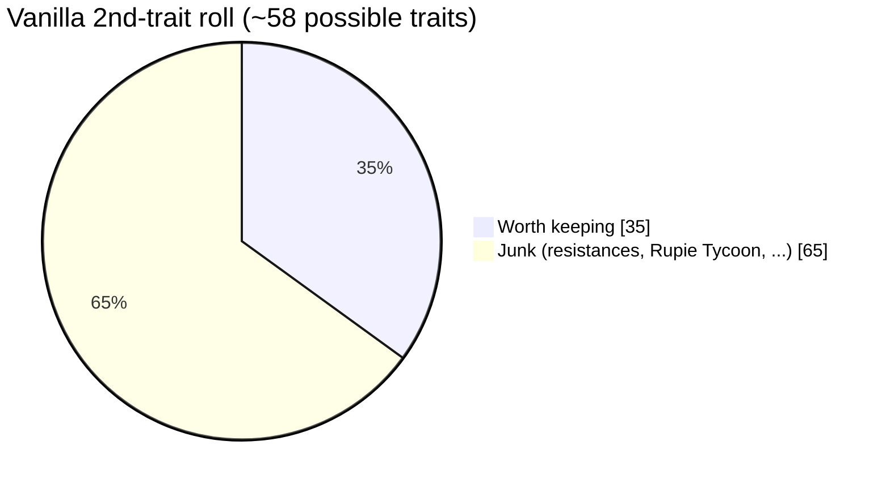
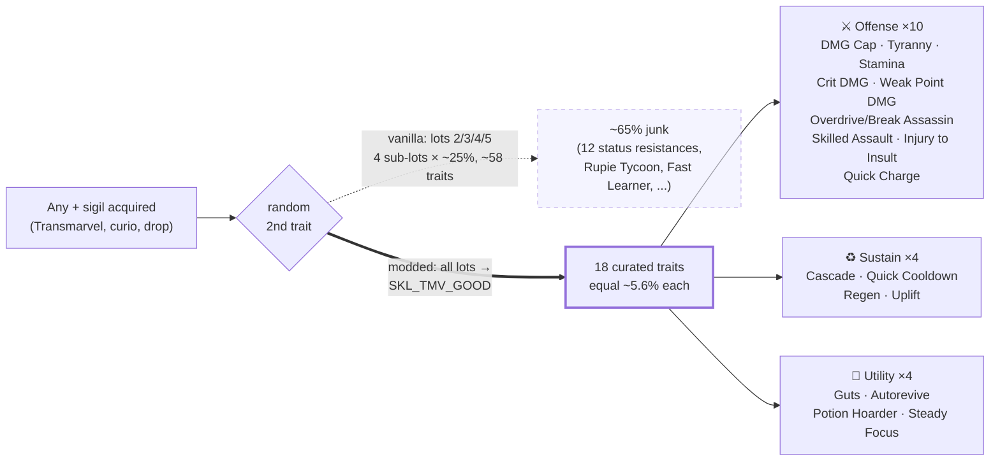

# Transmarvel Overhaul (Endless Ragnarok / 2.0)

> ⚠️ **Hobby project, not maintained.** Built for game **v2.0** — it *will* break on future
> updates and I won't patch it every time. For maintained mods, see
> [Nexus Mods](https://www.nexusmods.com/games/granbluefantasyrelink). Use at your own risk.

Transmarvel, fixed — one mod, three things:

1. **Jackpot sigil pool.** Every Transmarvel sigil roll is one of **41 chase sigils at
   equal ~2.4% odds**: the 13 top V+ generics (War Elemental+, Supplementary Damage V+,
   Berserker Echo+, Spartan Echo+, Greater Aegis V+, Celestial ×6 V+, Fatebreaker V+,
   Divergence V+) plus **all 28 character Warpath+ sigils** (max trait). Wrightstone
   rolls are always **tier-3 Transmarveled** (vanilla: 0.1%).
2. **No junk secondary traits.** The random 2nd trait on any "+" sigil (V+ or
   character+) rolls only from a curated 18-trait list, equal odds — 10 offense
   (DMG Cap, Tyranny, Stamina, Critical Hit DMG, Weak Point DMG, Overdrive Assassin,
   Break Assassin, Skilled Assault, Injury to Insult, Quick Charge), 4 sustain (Cascade,
   Quick Cooldown, Regen, Uplift), 4 utility (Guts, Autorevive, Potion Hoarder, Steady
   Focus). No resistances, no filler. Applies at acquisition from any source.
3. **Voucher income.** Every quest clear at **Chaos and above** grants guaranteed
   Transmarvel Vouchers: Chaos ×1, Chaos+ ×1, Chaos++ ×2, Infinity ×3 (all 56 Chaos+
   quests).

**Scope, precisely**: features 1 and 3 are Transmarvel/Chaos-only — curio transmutation
keeps its vanilla sigil pools, everything below Chaos keeps vanilla rewards, and the
75/25 sigil-vs-wrightstone split stays vanilla. Feature 2 is **game-wide by design**:
the 2nd-trait roll is a property of the sigil itself (not of where it dropped), so any
"+" sigil from any source — curios included — gets a curated secondary. There is no
per-source hook in the game data; the upside is junk secondaries can't roll anywhere.

### What the secondary-trait filter changes

Vanilla rolls the 2nd trait through one of four "type lots", each spread across
sub-lots full of filler — **only ~1 roll in 3 lands a trait worth keeping**:

The mod reroutes **every** trait lot to one curated pool, so it's 100% keepers:

## Install

Requires [Reloaded-II](https://github.com/Reloaded-Project/Reloaded-II/releases) +
[GBFR Mod Manager](https://www.nexusmods.com/granbluefantasyrelink/mods/526) (**2.0.1+**).
First Reloaded-II setup: [Installing Mods — relink-modding](https://nenkai.github.io/relink-modding/modding/installing_mods/).

1. Download **`transmarvel-overhaul-v1.zip`** from the
   [transmarvel-overhaul-v1 release](https://github.com/alexfrljuckic/GBFRelinkMod/releases/tag/transmarvel-overhaul-v1).
2. Extract into `Reloaded-II\Mods\` → `Mods\gbfr.transmarvel.overhaul\`.
3. Enable **Transmarvel Overhaul (2.0)** in the game's mod list; launch.

> ⚠️ Disable any other mod shipping `gacha_rate_group.tbl`, `gacha_lot.tbl`,
> `reward.tbl`, `reward_lot.tbl`, `skill_lot.tbl`, or `skill_type_lot.tbl`
> (e.g. Endgame Rebalance Plus, Transmarvel Wrightstone Max Level).

## If something blows up (troubleshooting)

- **"Oh Noes! … An Application Control policy has blocked this file (0x800711C7)"** —
  Windows **Smart App Control** is blocking Reloaded's unsigned community DLLs. Fix:
  *Windows Security → App & browser control → Smart App Control settings → Off*
  (one-way switch; regular SmartScreen stays on). Hits fresh Windows 11 installs where
  SAC silently flips itself to enforcing.
- **Mods silently don't apply** (rolls look vanilla, no Reloaded console window):
  Reloaded never injected — GBFR's Steam DRM breaks launcher injection. In Reloaded-II:
  *Edit Application → Advanced Tools & Options → Deploy ASI Loader*. With the deployed
  `Reloaded.Mod.Loader.Bootstrapper.asi` + `winmm.dll` in the game folder, mods load
  even from plain Steam launches. Tell: no new log in
  `%APPDATA%\Reloaded-Mod-Loader-II\Logs` = no injection.
- **Verify it's on**: the Reloaded console should list `Transmarvel Overhaul (2.0)` and
  the Mod Manager registering the six tables.

## Removing Warpath+ sigils that can't roll anything new
A dupe is only worthless per **combo**: Warpath + DMG Cap is a different sigil
than Warpath + Cascade (the random 2nd trait, 18 possible with this mod). A
Warpath+ only stops being worth pulling once you own it with **all 18**
secondaries — at that point you can prune it from the pool, and the remaining
sigils stay exactly equal.

**Requirements** (beyond the mod itself): this repo checked out with its toolchain set
up (GBFRDataTools + 2.0 headers, sqlite CLI, .NET 10 runtime — one-time setup, see
[docs/06](../../docs/06-toolchain-setup.md)), Node.js 18+, and the game installed.
This is repo tooling — if you only downloaded the release zip, you can't run it.

**How to run**:
1. From the repo root: `node scripts/build-jackpot-tables.mjs`
2. That's it — the script **reads your save file** (read-only; it never writes the
   save), works out which secondary combos you own per Warpath+, prints a per-sigil
   `X/18` coverage report, prunes only the fully-covered ones, rebuilds from vanilla
   game data, writes into this mod folder, **and updates the installed copy in
   `Reloaded-II\Mods` automatically** (if present).
3. Prefer deciding yourself (or the save format changed in a game update)? Open
   [scripts/build-jackpot-tables.mjs](../../scripts/build-jackpot-tables.mjs), set
   `OWNED_WARPATH = MANUAL_WARPATH`, and uncomment each sigil to prune outright —
   the full id → name list (all 28) is right there in the file.

Auto-detect reads the newest `SaveData<N>.dat` in `%localappdata%\GBFR\Saved\SaveGames`
(sigil-inventory format: [docs/21](../../docs/21-save-sigil-inventory.md)) and refuses
loudly — rather than guessing — if the layout doesn't match.

**When does it take effect?** On the **next game launch** — the Mod Manager reads mod
tables once, during boot. Running the script while the game is open is harmless, but
you must restart the game to see the change. Nothing to click in Reloaded-II.

## Uninstall
Untick the mod (or delete `Mods\gbfr.transmarvel.overhaul\`). Game files on disk are
never modified — tables are injected at runtime.

## How it works
Six data tables, all byte-diff verified against vanilla 2.0:
- `gacha_rate_group.tbl` — Transmarvel groups `27509C51`/`67716D8A`: only the chase
  buckets keep weight (1250/2000/7000 ∝ 5/8/28 items = all sigils equal; wrightstone
  `BD1CBF1C` = 10000). Decode: [docs/15](../../docs/15-transmarvel-pool-decoded.md).
- `skill_lot.tbl` + `skill_type_lot.tbl` — new curated sub-lot `SKL_TMV_GOOD` (+18
  rows); type-lots 2 (generic V+) & 5 (character+) point at it 100%. Shared vanilla
  sub-lots untouched.
- `reward.tbl` + `reward_lot.tbl` — 3 appended guaranteed lots (`RWL_TMV_1/2/3` →
  Transmarvel Voucher ×1/×2/×3) wired into 112 per-clear reward slots across the 56
  Chaos+ quests. Decode: [docs/16](../../docs/16-quest-reward-chain.md).

Rebuild: `scripts/build-jackpot-tables.mjs` (pool), `scripts/build-voucher-mod.mjs`
(vouchers), 2.0 headers in [patches/headers-2.0/](../../patches/headers-2.0/).
